[TOC]

------

# Sistemas operativos

Un **sistema operativo** (SO) es un software fundamental que actúa como intermediario entre la parte física de una computadora (*hardware*) y las aplicaciones que se ejecutan en ella (*software*). Su función principal es gestionar los recursos del sistema y proporcionar una interfaz para que los usuarios interactúen con la máquina.

Un sistema operativo debe realizar las siguientes tareas:

1. **Gestión de recursos**:
   - Controla la asignación de CPU, memoria, dispositivos de entrada/salida y almacenamiento.
   - Administra procesos, hilos y programas en ejecución.
2. **Interfaz de usuario**:
   - Facilita la ejecución de programas y la gestión de archivos.
   - Proporciona una interfaz gráfica y/o de línea de comandos para que los usuarios interactúen con la computadora.
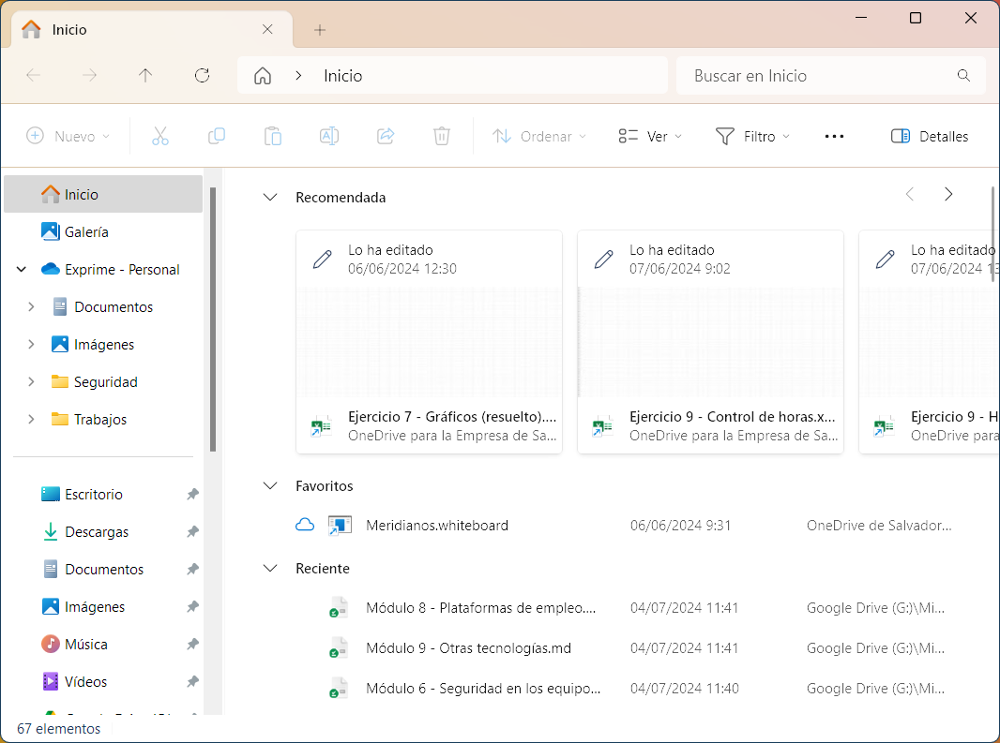
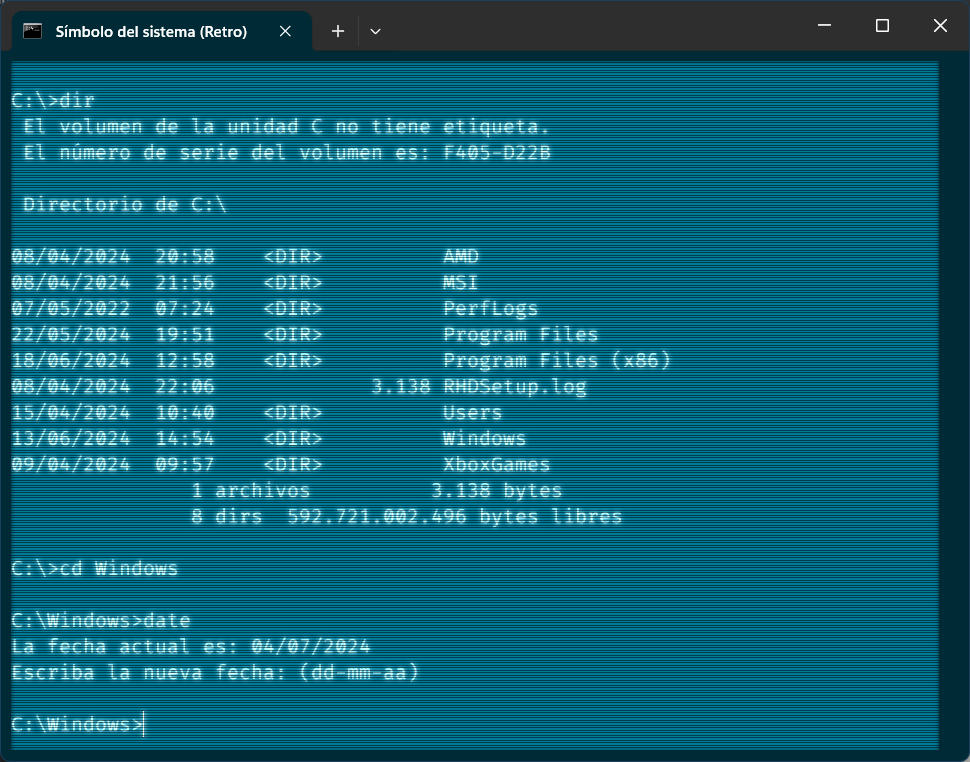

3. **Seguridad y protección**:
   - Controla el acceso a recursos y datos.
   - Implementa medidas de seguridad como contraseñas y permisos.

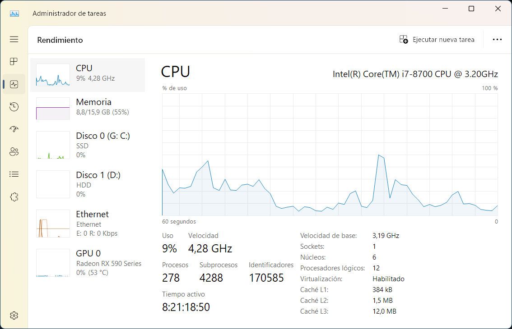

## Windows

Windows es un sistema operativo desarrollado por Microsoft. Es el software que gestiona los recursos de un ordenador y proporciona servicios esenciales para las aplicaciones y el usuario. Desde su lanzamiento inicial en 1985, Windows se ha convertido en el sistema operativo más utilizado en el mundo para computadoras personales.

### Historia y versiones

- **Windows 1.0 (1985):** El primer sistema operativo de la serie Windows, Windows 1.0, fue lanzado el 20 de noviembre de 1985. Era una interfaz gráfica de usuario (GUI) rudimentaria que operaba sobre MS-DOS, permitiendo a los usuarios realizar múltiples tareas con aplicaciones de gráficos simples como Paint y Notepad.

- **Windows 3.0 (1990):** Esta versión trajo mejoras significativas en la interfaz gráfica y en la capacidad de multitarea. Incluía el Administrador de Programas, el Administrador de Archivos y un entorno gráfico mejorado. En 1992 lanzaron Windows 3.1x, que es la que convirtió en un gran éxito mundial.

  

- **Windows 95 (1995):** Un gran salto en la evolución de Windows, Windows 95 introdujo el botón de "Inicio", la barra de tareas y el explorador de archivos con una interfaz de usuario significativamente mejorada. Fue la primera versión en incluir soporte para nombres de archivo largos y Plug and Play para hardware.

  

- **Windows XP (2001):** Una de las versiones más populares de Windows, conocida por su estabilidad y facilidad de uso. Windows XP introdujo una nueva interfaz gráfica, mejor gestión de redes, y mayores capacidades de multimedia.

  

- **Windows Vista (2006):** Aunque introdujo una interfaz de usuario completamente nueva llamada Aero y varias características de seguridad mejoradas, Windows Vista fue criticado por sus altos requisitos de hardware y problemas de compatibilidad.

  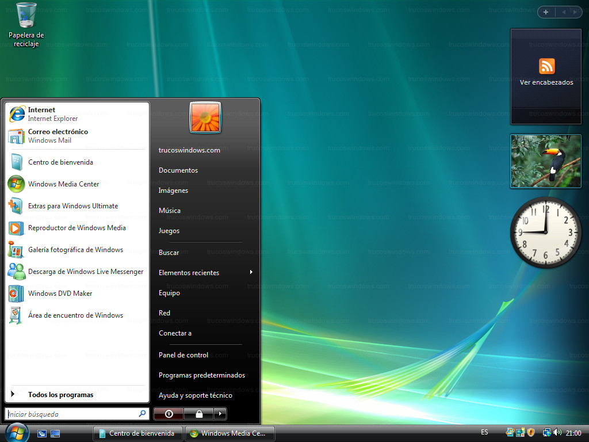

- **Windows 7 (2009):** Windows 7 corrigió muchos de los problemas de Vista y es conocido por su rendimiento mejorado y facilidad de uso. Introdujo características como la barra de tareas rediseñada, Jump Lists y mejoras en la administración de ventanas.

  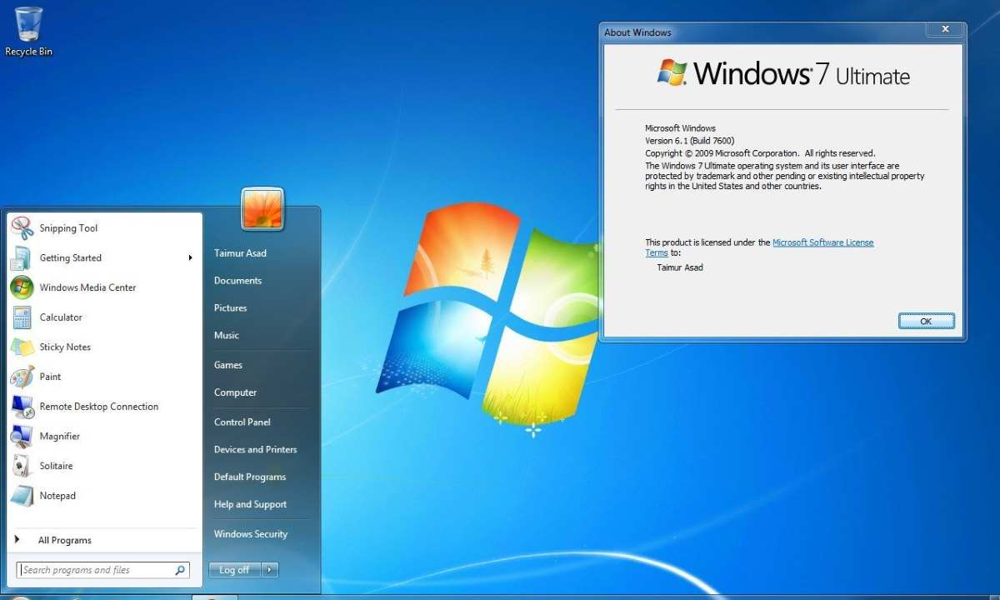

- **Windows 8 (2012):** Esta versión presentó una interfaz radicalmente nueva con Live Tiles y una pantalla de inicio optimizada para dispositivos táctiles. Sin embargo, la eliminación del botón de Inicio tradicional causó controversia entre los usuarios.

  

- **Windows 10 (2015):** Windows 10 combinó elementos de Windows 7 y 8, reintroduciendo el botón de Inicio y mejorando la integración de aplicaciones tanto para dispositivos táctiles como para PCs tradicionales. Ofreció actualizaciones de seguridad constantes y el asistente digital Cortana.

  

- **Windows 11 (2021):** La versión más reciente, Windows 11, trajo una interfaz de usuario modernizada con esquinas redondeadas, un nuevo diseño del menú de Inicio, mejoras en la productividad y una mayor integración con Microsoft Teams. Además, ofrece mejoras en rendimiento y soporte para aplicaciones de Android.

  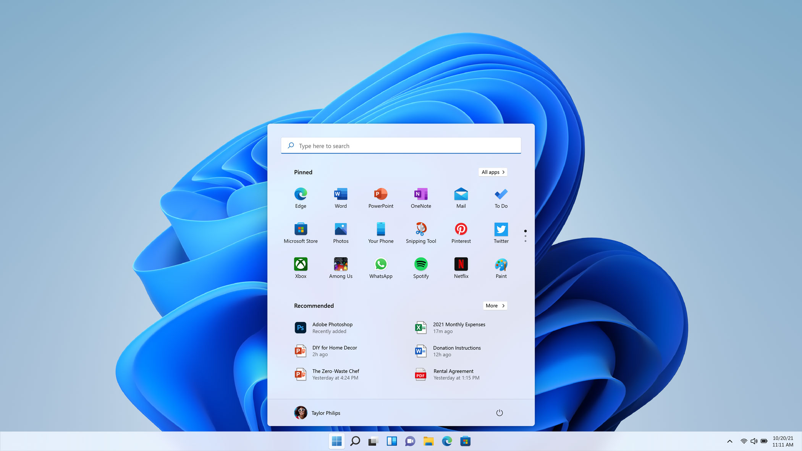

## Android

Android es un sistema operativo móvil desarrollado por **Google**, basado en el núcleo Linux. Está diseñado principalmente para dispositivos móviles con pantalla táctil, como smartphones y tabletas. Android es el sistema operativo móvil más utilizado en el mundo, conocido por su flexibilidad, personalización y amplia compatibilidad con una gran variedad de dispositivos y aplicaciones.

### Historia y versiones

- **Origen y Desarrollo:** Android Inc. fue fundada en octubre de 2003 por Andy Rubin, Rich Miner, Nick Sears y Chris White, con la intención de desarrollar un sistema operativo avanzado para cámaras digitales. Sin embargo, pronto ampliaron su enfoque hacia los dispositivos móviles en general. En 2005, Google adquirió Android Inc., y desde entonces, ha estado a la vanguardia del desarrollo del sistema operativo.
- **Primeras Versiones:** La primera versión comercial de Android, Android 1.0, fue lanzada en septiembre de 2008 con el primer teléfono Android, el HTC Dream (también conocido como T-Mobile G1). Esta versión incluyó las aplicaciones de Google como Gmail, Maps, y el navegador web.
- **Evolución Reciente:** A lo largo de los años, Android ha evolucionado significativamente, añadiendo nuevas características, mejorando la interfaz de usuario, y optimizando el rendimiento y la seguridad. Aquí hay una breve descripción de las últimas versiones:
  - **Android 11 (2020):** Trajo mejoras en la gestión de conversaciones, controles de dispositivos inteligentes, y permisos de un solo uso para aplicaciones.
  - **Android 12 (2021):** Presentó Material You, un rediseño visual significativo que permite personalizar la interfaz del sistema con colores dinámicos basados en el fondo de pantalla.
  - **Android 13 (2022):** Incluyó mejoras en la personalización, la privacidad y la seguridad, así como una mejor integración con dispositivos de diferentes tamaños y formas, incluyendo tabletas y dispositivos plegables.
  - **Android 14 (2023)**: Continúa mejorando la experiencia del usuario y la seguridad e incluye mejoras en la gestión de notificaciones, mayor control sobre permisos de aplicaciones y optimizaciones de rendimiento.

Inicialmente cada versión nueva de Android tenía un nombre en clave basado en un postre o dulce, siguiendo el orden alfabético. Esta tradición comenzó con Android 1.5 (Cupcake) y continuó hasta Android 9 (Pie). Sin embargo, Google decidió cambiar esta convención ya que no todos los nombres eran reconocidos o comprendidos mundialmente. Cambiar a números hace que las versiones sean más fácilmente reconocibles y comprensibles a nivel mundial.

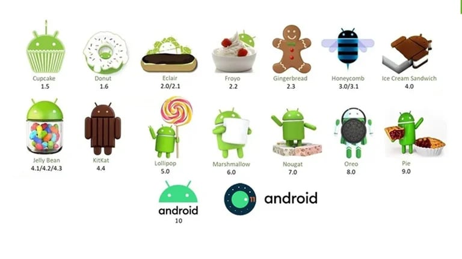

> [!NOTE]
>
> 🤓Aunque públicamente las versiones ya no llevan nombres de dulces, internamente Google sigue utilizando nombres de postres para sus proyectos. Por ejemplo, Android 10 era conocido internamente como "Quince Tart", Android 11 como "Red Velvet Cake" y Android 12 como "Snow Cone".

----

# Empezando con Windows

> [!IMPORTANT] 
> Acabamos de ver una introducción a ambos sistemas operativos ya que es importante establecer una base, diferenciarlos claramente y tener una visión global de ambos. Durante todo el curso nos centraremos en Windows y ocasionalmente usaremos alguna aplicación concreta de Android.

En el momento en el que encendemos nuestro ordenador y Windows inicia, lo que vemos es lo que se llama la **pantalla de bloqueo**. Se trata de una imagen que podemos personalizar y que nos ofrece lo que podríamos considerar como información preliminar antes de trabajar cada día. La fecha, la hora, si la conexión de Internet está establecida o no y notificaciones personalizadas que, como veremos más adelante, podemos configurar. Algo como lo siguiente, con una de las imágenes preestablecidas de Windows.

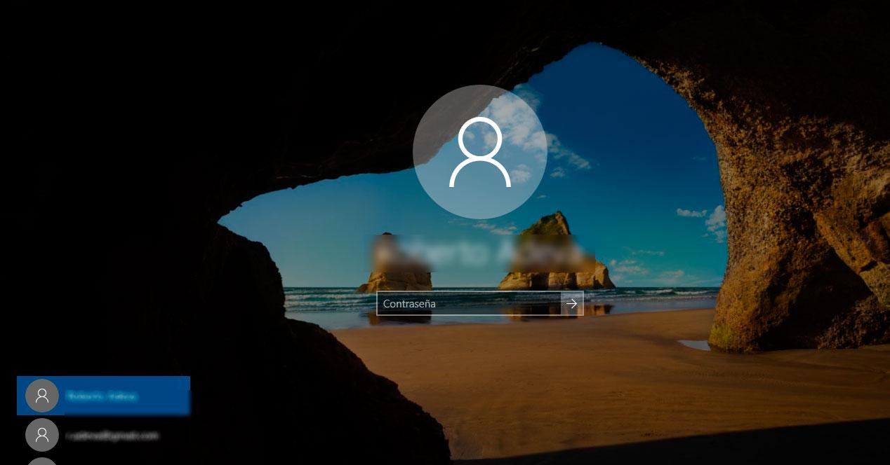

Aquí deberemos identificarnos como usuario del sistema operativo (algo que veremos más adelante). Para ello, debemos elegir un usuario de la lista de la esquina inferior izquierda y posteriormente introducir la contraseña o pin que se haya establecido para ese usuario. Los usuarios y contraseñas normalmente se crean durante la instalación del sistema operativo, aunque se pueden gestionar a posteriori (añadir, eliminar usuarios, cambiar contraseñas, etc.).

Para nuestro caso, deberemos seleccionar el usuario que nos indique el instructor del curso y para la contraseña lo mismo. Ambas cosas nos la deben de proporcionar ya que los equipos ya tendrán la cuenta de usuario configurada.

Una vez que entramos en el sistema, llegamos al **Escritorio de Windows**. Es el lugar donde trabajaremos cotidianamente. Aquí es donde ejecutaremos los programas, abrimos los archivos, buscamos cosas, etc. 

En la siguiente sección pasaremos a describir cada una de las partes fundamentes del escritorio de Windows.

---

# Interfaz de usuario

La interfaz de usuario de Windows **es el entorno gráfico que permite a los usuarios interactuar con el sistema operativo** y realizar tareas en sus computadoras. Aunque ha evolucionado a lo largo de las distintas versiones, los elementos fundamentales han permanecido relativamente constantes, facilitando la familiarización y el uso a través de las versiones. 

En esta sección, exploraremos las partes principales de la interfaz de usuario de Windows: el menú de inicio 🟩, la barra de búsqueda 🟧, la barra de tareas ⬜ y la bandeja del sistema 🟦.

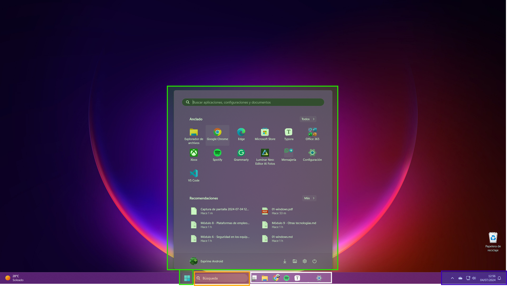

## 🟩Menú inicio

El botón <kbd>Inicio</kbd> nos permite acceder a todas las opciones que nos ofrece Windows en cualquiera de sus versiones. Si lo pulsamos se desplegará un menú similar al siguiente.

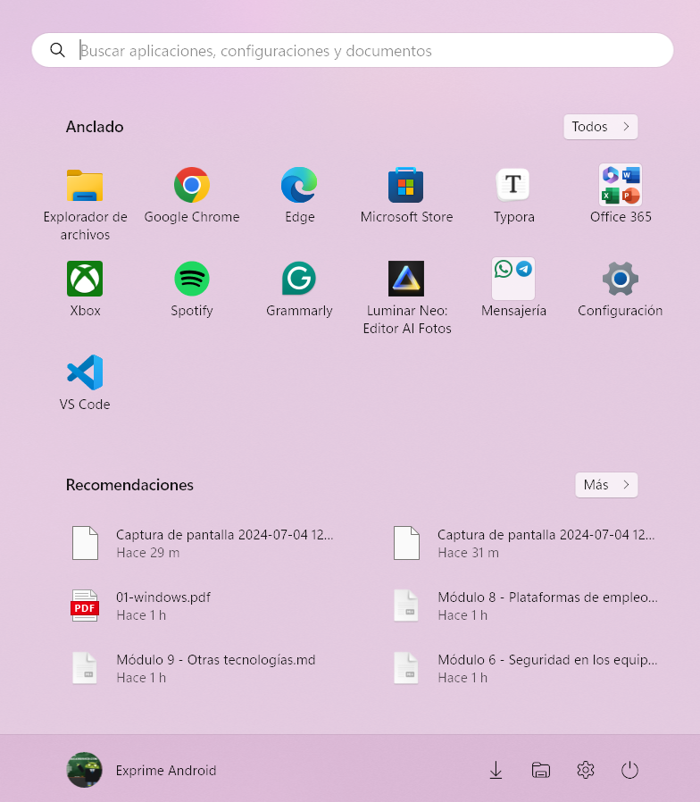

Dependiendo de la versión de Windows, puede cambiar la disposición de los elementos, pero siempre aparecerán de una forma u otra lo siguiente:

- **Aplicaciones**: Podrás acceder directamente a las aplicaciones que estén instaladas haciendo clic sobre sus iconos.

- **Recomendaciones**: Pueden ser archivos recientes que has usado o anuncios de aplicaciones.

- **Barra de búsqueda:** Es un cuadro de texto para buscar aplicaciones, documentos o secciones de configuración. Tan solo tenemos que empezar a escribir cuando abramos el menú de inicio, y directamente nos saldrán filtrados los elementos que coincidan con la búsqueda.

  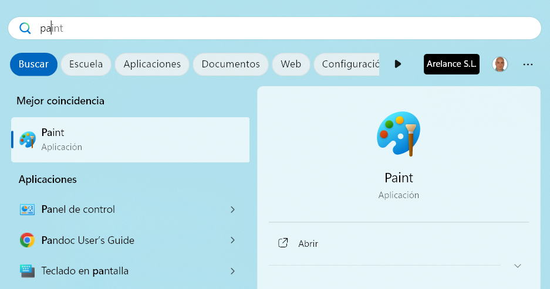

- **Usuario activo:** Aparecerá el nombre e imagen del usuario activo que tiene la sesión iniciada. Pulsando sobre él podremos cambiar de usuario o cerrar la sesión, entre otras opciones.

- **Configuración**: Acceso a la configuración del sistema operativo.

- **Opciones de apagado:** Sirve para apagar, reiniciar, suspender e hibernar el equipo. 

  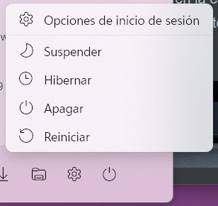

> [!TIP]
>
> Para abrir y cerrar el menú de inicio, podemos hacer clic en el botón <kbd>Inicio</kbd>, en la esquina inferior izquierda en la mayoría de las veces. Casi todos los teclados modernos incluyen una tecla directa para abrir y cerrar el menú inicio, suele tener el icono de Windows y está situada entre las teclas <kbd>Control</kbd> y <kbd>Alt</kbd> izquierdos.
>
> 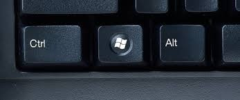

## ⬜Barra de tareas

#### Descripción General

La barra de tareas es un componente esencial de la interfaz de usuario de Windows, ubicada generalmente en la parte inferior de la pantalla. Su propósito es proporcionar acceso rápido y fácil a las aplicaciones, archivos y configuraciones, así como mostrar información de estado y notificaciones importantes. A lo largo de las versiones de Windows, la barra de tareas ha evolucionado para incluir más funcionalidades y mejorar la experiencia del usuario.

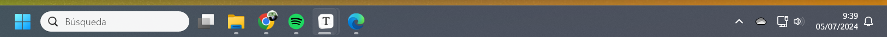

#### Funcionalidades principales

Según la captura anterior, aparecen en orden los siguientes elementos:

1. **Botón de Inicio:** El botón de inicio se encuentra en el extremo izquierdo de la barra de tareas. Al hacer clic en este botón, se abre el menú de inicio, desde donde puedes acceder a todas las aplicaciones, configuraciones y archivos. En Windows 11 por primera vez se sitúa por defecto en el centro en lugar de a la izquierda.

2. **Barra de Búsqueda:** En Windows 10 y 11, la barra de tareas puede incluir una barra de búsqueda que permite a los usuarios buscar rápidamente aplicaciones, archivos y configuraciones en su computadora. También puede realizar búsquedas en la web y, en algunas versiones, integrarse con Cortana, el asistente digital de Microsoft, para realizar búsquedas y ejecutar comandos de voz.

3. **Vista de Tareas:** La vista de tareas, accesible mediante un botón en la barra de tareas o presionando <kbd>Win + Tab</kbd>, muestra todas las aplicaciones y ventanas abiertas en una vista en miniatura. También permite acceder a los escritorios virtuales, que son escritorios adicionales donde puedes organizar tus aplicaciones y ventanas abiertas en grupos separados para mejorar la productividad.

   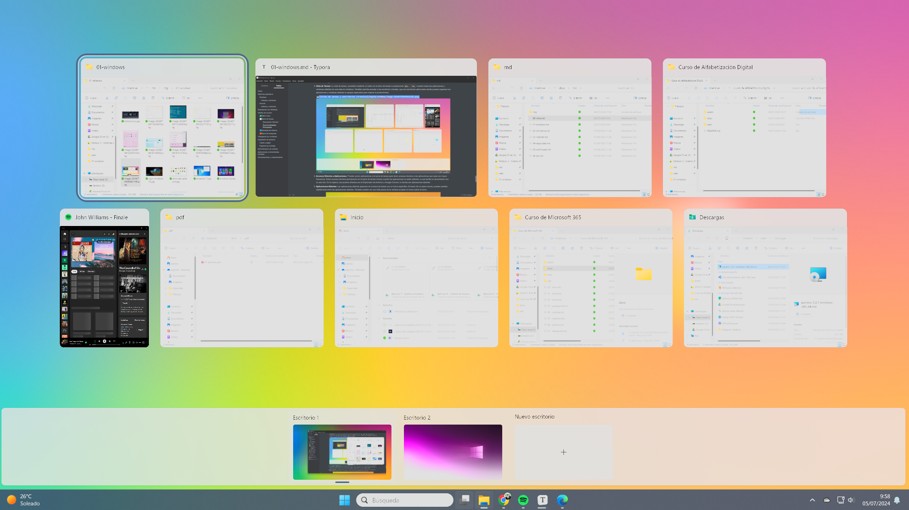

4. **Accesos Directos a Aplicaciones:** Puedes anclar aplicaciones a la barra de tareas para tener accesos directos a las aplicaciones que usas con mayor frecuencia. Estos accesos directos permanecen en la barra de tareas incluso cuando las aplicaciones no están abiertas, lo que facilita su lanzamiento con un solo clic. En la captura, los accesos directos son el Explorador de Archivos y Google Chrome, lo demás son aplicaciones abiertas. Para anclar una aplicación en la barra de tareas, haz clic con el botón derecho del ratón sobre el icono de una aplicación y selecciona “Anclar a la barra de tareas”.

   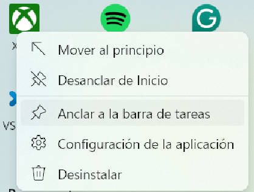

5. **Aplicaciones Abiertas:** Las aplicaciones abiertas aparecen en la barra de tareas con un icono específico. Al hacer clic en estos iconos, puedes cambiar rápidamente entre las aplicaciones abiertas. También puedes ver una vista previa de la ventana al pasar el cursor sobre el icono.

   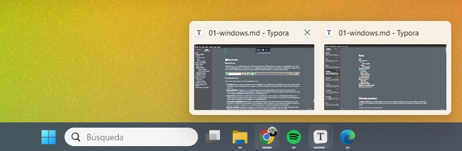

6. **Área de Notificaciones (Bandeja del Sistema):** El área de notificaciones está situada en el extremo derecho de la barra de tareas. Muestra íconos de estado y notificaciones de diversas aplicaciones y servicios del sistema. Lo detallaremos en el siguiente punto.

> [!TIP]
>
> Un icono en la barra de tareas con subrayado o borde indica que la aplicación está abierta, mientras que un icono sin subrayado es solo un acceso directo para iniciar la aplicación (que puede estar abierta o no). Si dicha aplicación no tiene acceso directo, al cerrarla, desaparece de la barra de tareas.

## 🟦Bandeja del sistema

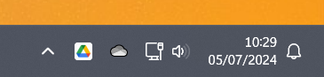

**Área de Notificaciones (Bandeja del Sistema):** El área de notificaciones está situada en el extremo derecho de la barra de tareas. Muestra íconos de estado y notificaciones de diversas aplicaciones y servicios del sistema. Está compuesta a su vez por:

- **Fecha y hora:** Muestra la fecha y hora del sistema, así como acceso al calendario y modo concentración (Windows 11).

- **Iconos del Sistema:** Indicadores para el volumen, la red, la batería (en dispositivos portátiles)

- **Notificaciones de Aplicaciones:** Alertas y mensajes de aplicaciones que se ejecutan en segundo plano, como antivirus, mensajería y actualizaciones de software.

- **Configuración rápida:** Un panel que agrupa todas las notificaciones del sistema y ofrece accesos directos a configuraciones rápidas como Wi-Fi, modo avión, brillo de la pantalla, bluetooth, etc.

  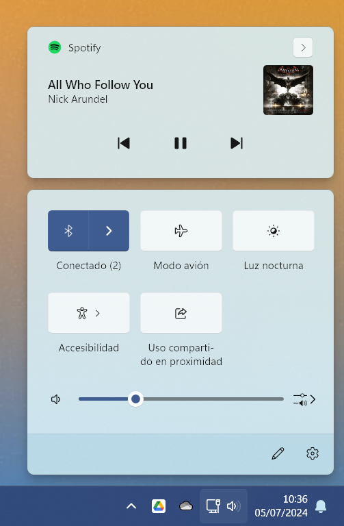

## 🟧Barra de búsqueda

Ahora la caja de búsqueda se encuentra de modo permanente junto al botón de **Inicio**. Ahí podemos escribir una palabra o frase y ésta se buscará por partida doble: como elemento en nuestro ordenador o como búsqueda en Internet.

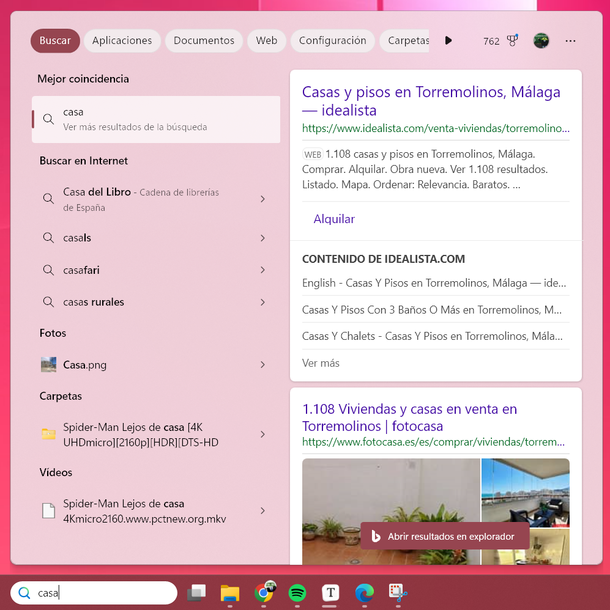

Podemos ver que introducimos en la barra de búsqueda la palabra <kbd>casa</kbd>, y nos mostrará los resultados de archivos, carpetas y accesos a configuración de mi ordenador que contengan dicha palabra, pero también realizará búsquedas en internet y nos mostrará directamente ahí los resultados. 

> [!IMPORTANT]
>
> Ten en cuenta que las búsquedas en internet integradas **usarán el motor de búsqueda Bing** y si se quiere abrir en un navegador, **usará Edge** de forma predeterminada. Por lo que si queremos tener el control de las búsquedas en internet, es mejor idea hacerlas siempre desde nuestro navegador favorito directamente. **Se recomienda usar la barra de búsqueda para buscar archivos y aplicaciones que tengamos instaladas en nuestro equipo, y no para búsquedas en internet.**

---

# Trabajando con ventanas

Las ventanas son el componente principal en el que se ejecutan las aplicaciones en Windows. Saber cómo manejar las ventanas eficientemente puede mejorar tu productividad y facilidad de uso. A continuación, se describen las operaciones básicas que puedes realizar con las ventanas.

## Maximizar, Minimizar y Restaurar

**Maximizar:**

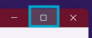

- **Descripción:** Expande la ventana para que ocupe toda la pantalla.
- **Cómo hacerlo:** Haz clic en el botón de maximizar (el cuadrado) en la esquina superior derecha de la ventana o doble clic en la barra de título de la ventana.

**Minimizar:**

- **Descripción:** Reduce la ventana a un icono en la barra de tareas.
- **Cómo hacerlo:** Haz clic en el botón de minimizar (el guion) en la esquina superior derecha de la ventana.

**Restaurar:**

- **Descripción:** Devuelve una ventana maximizada a su tamaño anterior.
- **Cómo hacerlo:** Haz clic en el botón de restaurar (dos cuadrados superpuestos) en la esquina superior derecha de la ventana o doble clic en la barra de título de la ventana si está maximizada.

## Redimensionar

**Descripción:** Cambiar el tamaño de la ventana según tus necesidades.

**Cómo hacerlo:**

1. **Cursor de Redimensionamiento:** Mueve el cursor a cualquier borde o esquina de la ventana hasta que se convierta en una flecha de dos puntas ↕️, ↔️.
2. **Arrastrar:** Haz clic y arrastra el borde o la esquina para aumentar o disminuir el tamaño de la ventana.

<video src="img/01-windows/redimensionar.mp4" autoplay loop></video>

## Mover

**Descripción:** Desplazar la ventana a una nueva posición en la pantalla.

**Cómo hacerlo:**

1. **Barra de Título:** Haz clic y mantén presionada la barra de título de la ventana (la barra en la parte superior de la ventana).
2. **Arrastrar:** Arrastra la ventana a la ubicación deseada y suelta el botón del ratón para colocarla.

<video src="img/01-windows/mover.mp4" autoplay loop></video>

## Acoplar (Snap)

**Descripción:** Acopla la ventana a una parte específica de la pantalla para facilitar la multitarea.

**Cómo hacerlo:**

1. **Acoplar a la Mitad:** Arrastra la ventana a uno de los lados de la pantalla hasta que aparezca una sombra indicando la mitad de la pantalla, y luego suelta el ratón.

   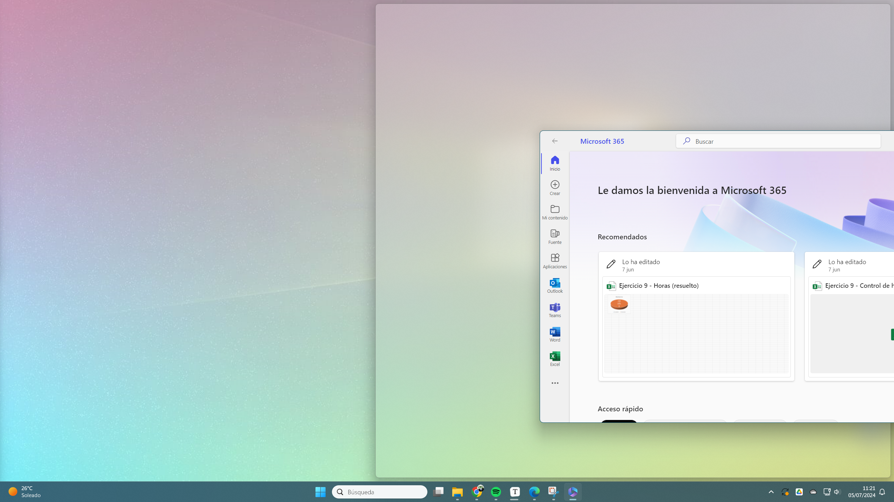

2. **Acoplar a un Cuarto:** Arrastra la ventana a una de las esquinas de la pantalla hasta que aparezca una sombra indicando un cuarto de la pantalla, y luego suelta el ratón.

   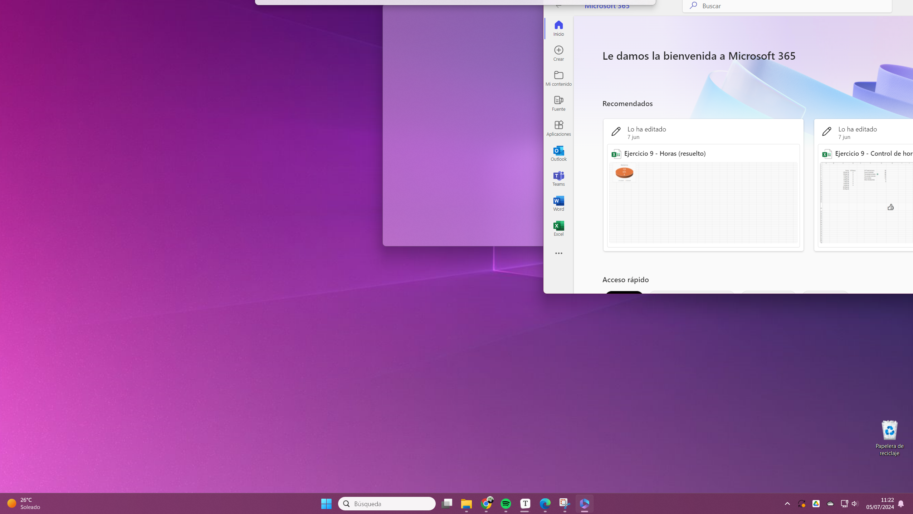

3. **Método de Teclado:** Presiona <kbd>Win + Flecha izquierda/derecha/arriba/abajo</kbd> para ajustar rápidamente la ventana a la mitad o un cuarto de la pantalla.

4. **Rejilla (A partir de Windows 11):** Este menú aparece cuando colocas el ratón sobre el botón maximizar o restaurar, y te permite reorganizar las ventanas abiertas en pantalla, distribuyéndolas simultáneamente en diseños en rejilla para aprovechar el espacio de la pantalla.

   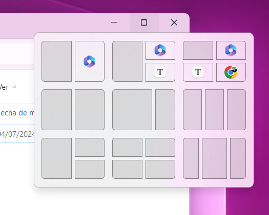

## Alternar entre ventanas

**<kbd>Alt + Tab</kbd>:**

- **Descripción:** Permite cambiar rápidamente entre las aplicaciones abiertas.

- **Cómo hacerlo:** Mantén presionada la tecla <kbd>Alt</kbd> y luego presiona repetidamente la tecla <kbd>Tab</kbd> para seleccionar la ventana deseada. Suelta ambas teclas para cambiar a la ventana seleccionada.

  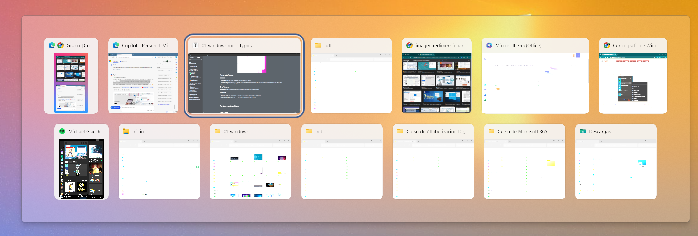

## Cerrar ventanas

**Descripción:** Cerrar una ventana para finalizar la aplicación o el documento que se está ejecutando.

**Cómo hacerlo:**

1. **Botón de Cerrar:** Haz clic en el botón de cerrar (la "X") en la esquina superior derecha de la ventana.
2. **Método de Teclado:** Presiona <kbd>Alt + F4</kbd> mientras la ventana está activa para cerrarla.

---

# Explorador de archivos

## Introducción
El Explorador de Archivos de Windows es la herramienta principal para gestionar y organizar tus archivos y carpetas. Permite realizar operaciones básicas como abrir, copiar, pegar, mover y borrar archivos, además de gestionar la papelera de reciclaje. A continuación, te explicamos cómo realizar estas operaciones básicas.

Es una aplicación más y suele estar representada por una carpeta con un diseño ligeramente distinto al resto de carpetas. Suele estar anclado en la barra de tareas de forma predeterminada.

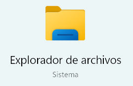

Una vez que se abierto, nos aparece una ventana como la siguiente:

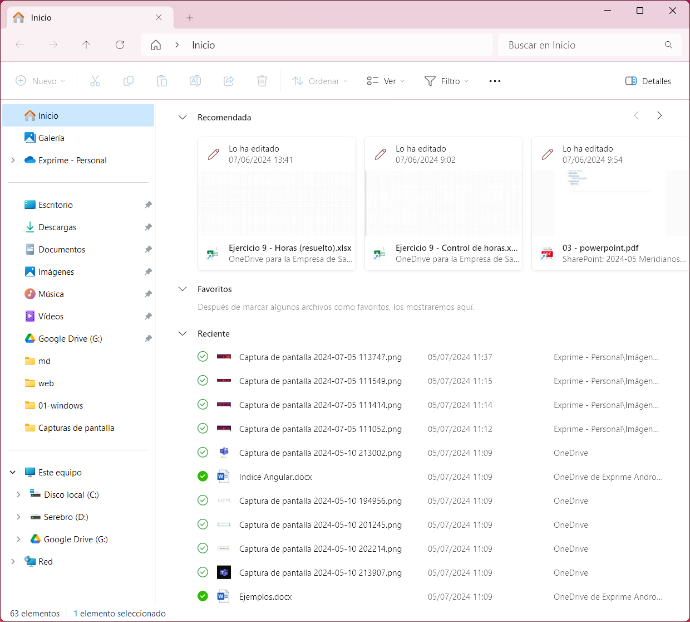

A la izquierda nos aparecerán las distintas ubicaciones de nuestro equipo y al hacer clic sobre ellas, nos aparecerá a la derecha el contenido de dicha ubicación. 

> [!IMPORTANT]
>
> Si hacemos doble clic sobre cualquier elemento, lo abriremos con la aplicación asociada para ese tipo de archivos. Por ejemplo, si hacemos doble clic sobre un archivo que es una imagen, se abrirá la aplicación *Fotos*. Si no hay instalada ninguna aplicación asociada, nos preguntará con cual aplicación debemos abrirla.

## Accesos directos

Los **accesos directos** son un tipo de archivo cuyo objetivo es **abrir de forma inmediata el archivo al que está vinculado**, ya sea un ejecutable, una carpeta, una imagen, un documento, etc. 

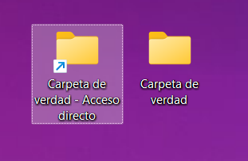

Los accesos directos los podemos crear en cualquier parte, y los distinguimos porque, aunque el icono se puede personalizar, tienen un pequeño cuadradito con una flecha en su parte inferior izquierda. Por ejemplo, cuando instalamos un programa en Windows, lo normal es que todos sus archivos se instalen en una carpeta llamada `Archivos de programa` de tu disco duro. Pero cuando queremos ejecutar la aplicación, no vamos a esa carpeta cada vez a buscar el archivo ejecutable, ya que en el proceso de instalación se crean también accesos directos en el **Escritorio** y en una carpeta en **Todas las aplicaciones**, en el **Menú Inicio**.

Por eso, aunque los accesos directos apuntan al archivo que ejecutan, son independientes, y **podemos borrarlos sin que eso borre el archivo o carpeta vinculado/a**.

- **Para abrir** un Acceso directo, igual que con otro tipo de archivo, basta con hacer doble clic sobre su icono.

- **Para crearlo** hay varias opciones:

  - **Nuevo:** `En una zona vacía del escritorio` > `Clic derecho` > `Nuevo` > `Acceso directo`. Nos aparecerá una asistente que nos guiará en el proceso.

  - **Enviar al escritorio:** `Seleccionar el archivo o carpeta que queremos crear el acceso directo` > `Clic derecho` > `Enviar a` > `Escritorio (crear acceso directo)`.

  - **⭐Arrastrando (Recomendado):** Si arrastras un archivo o carpeta con el botón derecho, al soltarlo el botón, nos aparecerá un menú contextual y podremos seleccionar <kbd>Crear iconos de acceso directo aquí</kbd>. Se recomienda esta forma ya que es la más simple y versátil.

    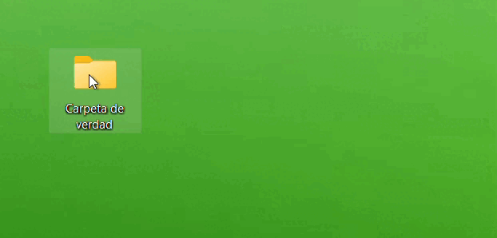
  
  

## Portapapeles

El portapapeles es una función de Windows que permite almacenar temporalmente datos que has copiado o cortado, como texto, imágenes y archivos, para luego pegarlos en otra ubicación. Es una herramienta esencial para realizar tareas de copia y pega de manera eficiente. 

### Historial del portapapeles

**Descripción:**  En las versiones anteriores solo se podía mantener un elemento en el portapapeles, de forma que al copiar un segundo elemento, se eliminaba el primero. En las versiones más recientes de Windows (10 en adelante), puedes activar y acceder al historial del portapapeles para ver y gestionar múltiples elementos copiados recientemente.

**Cómo hacerlo:**

1. Presiona <kbd>Win + V</kbd> para abrir el historial del portapapeles. Si es la primera vez que lo abres, te pedirá que si quieres activarlo.
2. Podrás ver todos los elementos que se han copiado al portapapeles. 

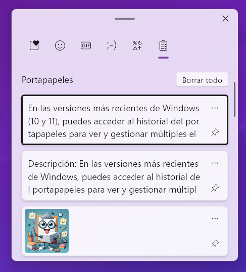

> [!TIP]
>
> Entender el concepto de portapapeles y manejar el historial del mismo nos ayudará a asimilar todas las siguientes acciones que veremos a continuación.

## Copiar y Pegar

**Copiar:**

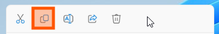

- **Descripción:** Duplica un archivo, carpeta o texto sin eliminar el original.
- **Cómo hacerlo:**
  1. Selecciona el archivo, carpeta o texto que deseas copiar.
  2. Haz clic derecho sobre el elemento seleccionado y selecciona "Copiar" del menú contextual, o presiona <kbd>Ctrl + C</kbd>.
  3. Esa acción creará una copia en el portapapeles.

**Pegar:**

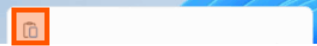

- **Descripción:** Inserta la copia del archivo, carpeta o texto en la ubicación deseada.
- **Cómo hacerlo:**
  1. Navega a la carpeta donde deseas pegar el archivo, carpeta o texto copiado.
  2. Haz clic derecho en la carpeta de destino y selecciona "Pegar" del menú contextual, o presiona <kbd>Ctrl + V</kbd>.

## Cortar

**Descripción:**
Traslada un archivo, carpeta o texto de una ubicación a otra, eliminándolo de su ubicación original.

**Cómo hacerlo:**
1. Selecciona el archivo, carpeta o texto que deseas cortar (mover).
2. Haz clic derecho sobre el elemento seleccionado y selecciona "Cortar" del menú contextual, o presiona <kbd>Ctrl + X</kbd>.
3. Navega a la carpeta de destino, o documento si es un texto.
4. Haz clic derecho en la carpeta o documento de destino y selecciona "Pegar" del menú contextual, o presiona <kbd>Ctrl + V</kbd>.

## Borrar

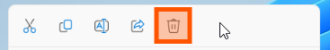

**Descripción:**
Elimina un archivo o carpeta, enviándolo a la papelera de reciclaje.

**Cómo hacerlo:**
1. Selecciona el archivo o carpeta que deseas borrar.
2. Haz clic derecho sobre el elemento seleccionado y selecciona "Eliminar" del menú contextual, o presiona la tecla <kbd>Supr</kbd> (*Delete* o Borrar) en el teclado.
3. Confirma que deseas enviar el elemento a la papelera de reciclaje si se te solicita.

## Papelera de Reciclaje

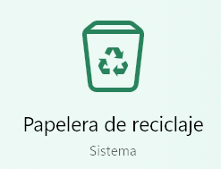

**Descripción:**
La papelera de reciclaje almacena temporalmente los archivos y carpetas eliminados, permitiendo recuperarlos si se borraron por error. Su ubicación es un icono en el escritorio que cambia según tenga contenido o esté vacía.

    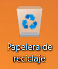
    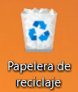

**Cómo funciona:**

1. **Uso:** Cuando borramos un archivo o carpeta, si no es excesivamente grande, se mueven automáticamente a la papelera de reciclaje. No hay que hacer nada en especial.
2. **Acceso:** Haz doble clic en el icono de la papelera de reciclaje en el escritorio para abrirla y ver su contenido.
3. **Restaurar Archivos:**
   - Selecciona el archivo o carpeta que deseas recuperar.
   - Haz clic derecho sobre el elemento seleccionado y selecciona <kbd>Restaurar</kbd> del menú contextual. El archivo o carpeta se devolverá a su ubicación original.
4. **Eliminar Permanentemente:**
   - Para vaciar la papelera de reciclaje y eliminar permanentemente todos los archivos, haz clic derecho en el icono de la papelera de reciclaje y selecciona <kbd>Vaciar papelera de reciclaje</kbd>.
   - Para eliminar permanentemente archivos específicos, selecciona los archivos dentro de la papelera de reciclaje, haz clic derecho y selecciona <kbd>Eliminar</kbd>.

---

# Administración de cuentas

Cada vez que empiezas a trabajar con Windows, debes de iniciar sesión con una cuenta de usuario. En breve aprenderás las distintas cuentas de usuario que existen y sus diferencias, pero primero tenemos que entender el motivo por el que se usan cuentas de usuario.

Es conveniente que **cada persona que use el PC lo haga en una cuenta de usuario por separado**. Esto proporciona varias ventajas como: 

- **Mantener la privacidad** de archivos y configuraciones personales. Cada usuario solo podrá acceder a sus propios archivos.
- **Permitir una personalización individual del entorno** de trabajo y mejorar la seguridad al limitar los permisos de cada cuenta. 
- **Facilitar la administración del sistema**, ya que las actualizaciones y configuraciones específicas solo afectan a la cuenta correspondiente, reduciendo el riesgo de conflictos entre usuarios.

> [!TIP]
>
> 🫧Cuando se elimina una cuenta de usuario, todos sus archivos y configuraciones se eliminan también. Esto significa que si hay algún problema con una cuenta específica, no afectará a las otras cuentas de usuario en el PC.

Administrar las cuentas de usuario en Windows es esencial para mantener la seguridad y organización en tu equipo. Hay diferentes tipos de cuentas que ofrecen distintas funcionalidades y niveles de acceso. 

En esta sección, explicaremos las diferencias entre las cuentas locales y las cuentas de Microsoft, así como las diferencias entre las cuentas de usuario estándar y las cuentas de administrador.

## Tipos de Cuentas

**Cuentas Locales:** Una cuenta local es una cuenta que solo existe en el equipo específico donde se crea. No está vinculada a ninguna cuenta en línea.

- Ventajas:
  - **Privacidad:** Los datos de la cuenta no se sincronizan con ningún servidor en línea.
  - **Simplicidad:** Es fácil de configurar y gestionar si no necesitas sincronización entre dispositivos.
- Desventajas:
  - **Limitaciones de Sincronización:** No permite sincronizar configuraciones y archivos entre dispositivos.
  - **Acceso a Servicios de Microsoft:** No permite el uso de algunos servicios y aplicaciones de Microsoft que requieren una cuenta de Microsoft.

**Cuentas de Microsoft:** Una cuenta de Microsoft es una cuenta en línea que permite acceder a servicios como OneDrive, Office 365 y sincronizar configuraciones y archivos entre dispositivos.

- Ventajas:
  - **Sincronización:** Permite sincronizar configuraciones, aplicaciones y archivos entre varios dispositivos.
  - **Acceso a Servicios:** Necesaria para utilizar servicios y aplicaciones de Microsoft, como OneDrive, Xbox, Microsoft Store y Outlook.
- Desventajas:
  - **Privacidad:** Los datos de la cuenta se almacenan en los servidores de Microsoft.
  - **Dependencia de Internet:** Requiere una conexión a internet para la sincronización completa y el acceso a ciertos servicios.

## Tipos de Usuarios

**Usuario Estándar:** Una cuenta de usuario estándar tiene permisos limitados y no puede realizar cambios que afecten a otros usuarios del equipo o al sistema en general.

- Ventajas:
  - **Seguridad:** Reduce el riesgo de instalar software malicioso y realizar cambios que puedan dañar el sistema.
  - **Protección:** Ideal para niños o usuarios que no necesitan realizar tareas administrativas.
- **Usos Comunes:** Navegar por internet, usar aplicaciones, realizar tareas diarias.

**Administrador:** Una cuenta de administrador tiene permisos completos para realizar cualquier cambio en el sistema, incluyendo la instalación de software, cambios en la configuración del sistema y la gestión de otras cuentas de usuario.

- Ventajas:
  - **Control Completo:** Permite gestionar y configurar el sistema en su totalidad.
  - **Acceso Total:** Necesario para tareas administrativas y de mantenimiento del sistema.
- Desventajas:
  - **Riesgo de Seguridad:** Usar una cuenta de administrador para tareas cotidianas puede aumentar el riesgo de cambios accidentales o de instalar software malicioso.
  - **Recomendación:** Es mejor utilizar una cuenta de usuario estándar para actividades diarias y solo usar la cuenta de administrador cuando sea necesario para realizar tareas específicas.

## Importancia de la seguridad

> [!IMPORTANT]
>
> 🚨**MUY IMPORTANTE**🚨
>
> Para mejorar la seguridad, **se recomienda utilizar una cuenta de usuario estándar** para las tareas diarias y reservar la cuenta de administrador para cambios específicos en el sistema.
>
> Usar una cuenta de administrador para todo puede hacer que el sistema sea más vulnerable a virus, malware y cambios accidentales que podrían afectar negativamente al sistema. Aunque tengas que introducir una contraseña para determinadas tareas, mejorará enormemente la seguridad del sistema. 

>  [!TIP]
>
> 🔐En Windows, además de las contraseñas tradicionales, **puedes optar por usar un PIN** (Número de Identificación Personal) para iniciar sesión en tu cuenta. Esta opción no solo facilita el inicio de sesión, sino que también mejora la seguridad. 
>
> 🔢A diferencia de las contraseñas, que pueden ser robadas y usadas en otros dispositivos, **el PIN es local**, lo que significa que **solo es válido en el dispositivo específico** en el que se configura. Esto **reduce significativamente el riesgo de que alguien acceda a tu cuenta desde otro equipo**, incluso si consiguen robar tu PIN. Además, **los PIN pueden ser más cortos y fáciles de recordar** que las contraseñas complejas, ofreciendo una combinación de seguridad y comodidad.
>
>  🤦‍♀️¡Y por favor, **no uses el mismo PIN** que para el banco!.

## Administración de Cuentas en el Panel de Control

Para crear o modificar cuentas de usuario, puedes ir al **Panel de Control** y seleccionar **"Cuentas de usuario"**. Desde allí, puedes crear nuevas cuentas, cambiar el tipo de cuenta y gestionar las configuraciones de las cuentas existentes.

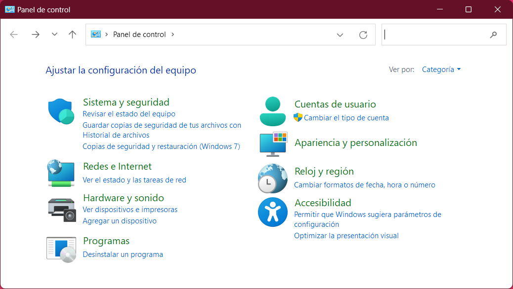

> [!NOTE]
>
> 🛡️Para crear nuevas cuentas o realizar cambios en las cuentas de usuario existentes, deberás ser administrador 🦸.

## Cambiar de cuenta de usuario

Para cambiar el usuario activo o bien cerrar la sesión actual, lo puedes hacer desde el **Menú Inicio**, como ya vimos en su [correspondiente sección](#🟩Menú Inicio).

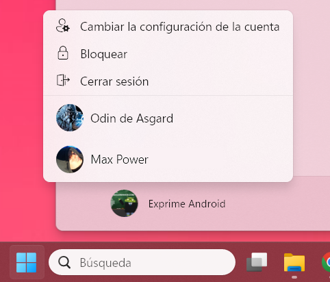

---

# Aplicaciones y herramientas incluidas

- **Paint**: Es una aplicación de dibujo básica que permite crear y editar imágenes sencillas. Ideal para tareas de edición rápida y anotaciones gráficas.

  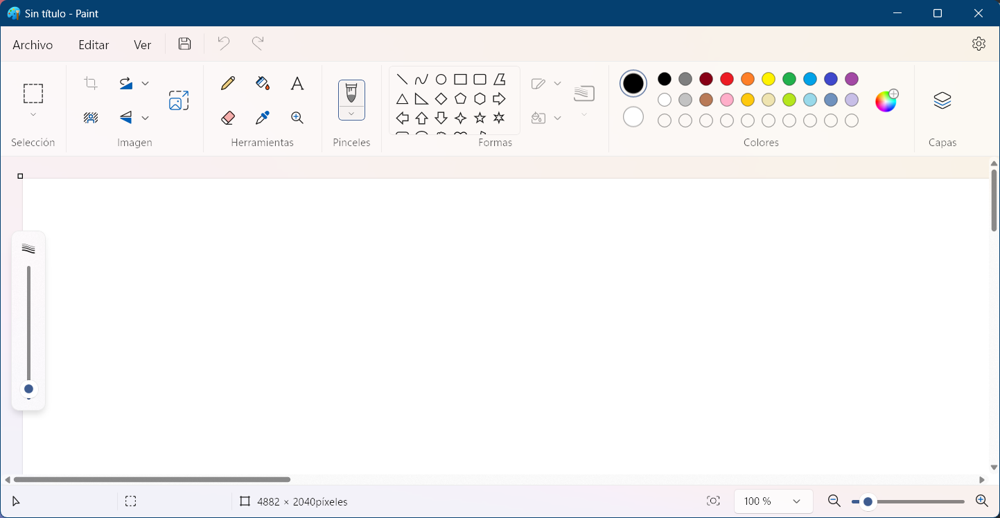

- **Bloc de Notas (Notepad)**: Es un editor de texto simple para escribir y editar documentos de texto plano. Útil para tomar notas rápidas y editar archivos de configuración.

  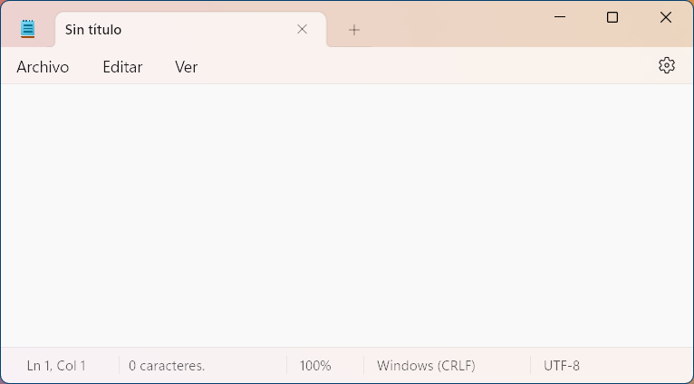

- **WordPad**: Es un procesador de textos básico que ofrece más funcionalidades que el Bloc de Notas, como el formato de texto y la inserción de imágenes. Adecuado para documentos simples.

  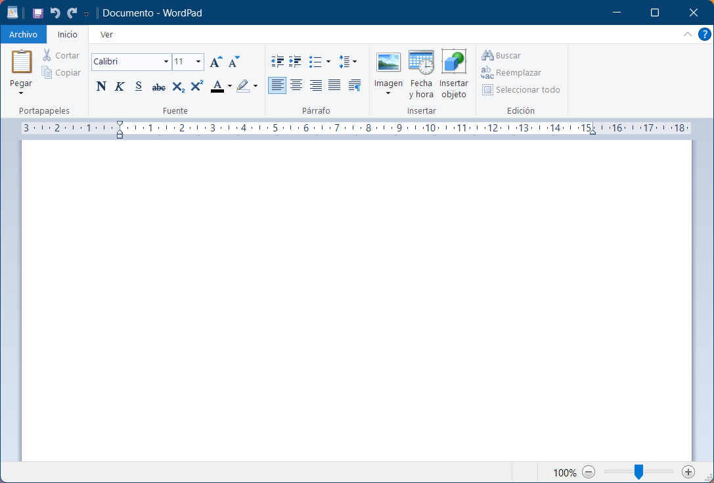

- **Calculadora**: Es una aplicación que ofrece funciones básicas y avanzadas de cálculo, incluyendo modos estándar, científico, programador y de conversión de unidades.

  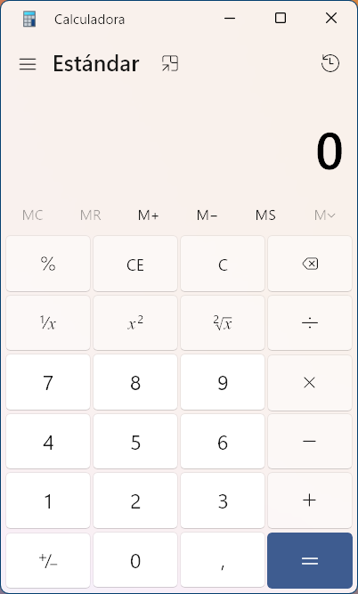

- **Microsoft Edge**: Es el navegador web predeterminado de Windows, basado en Chromium, que ofrece navegación rápida y segura por internet.

  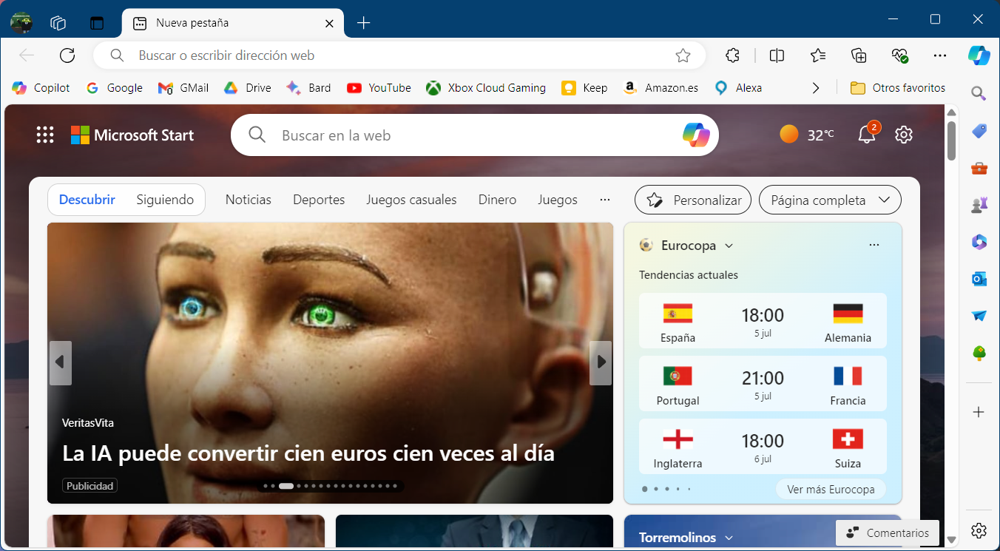

- **Correo (Mail)**: La aplicación de Correo permite gestionar múltiples cuentas de correo electrónico en una interfaz unificada, facilitando el acceso y la organización de tus correos.

- **Calendario**: La aplicación de Calendario se integra con Correo y otras cuentas de calendario para gestionar eventos, citas y recordatorios de manera eficiente.

- **Fotos**: Es una aplicación para visualizar, organizar y editar imágenes y vídeos almacenados en tu dispositivo o en la nube.

- **Películas y TV (Movies & TV)**: Es una aplicación que permite reproducir vídeos y gestionar tu colección de películas y programas de televisión, con soporte para streaming desde la tienda de Microsoft.

- **Grabadora de Sonido**: Grabadora de sonidos permite grabar audio utilizando el micrófono del dispositivo, ideal para notas de voz y grabaciones rápidas.

  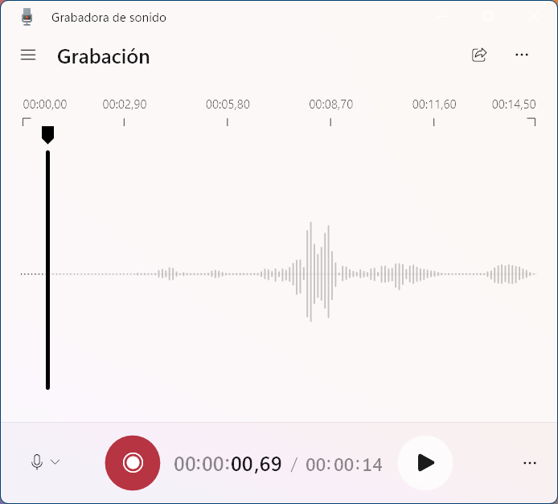

- **Solitaire Collection**: Incluye varios juegos de cartas clásicos como Klondike, Spider y FreeCell, proporcionando entretenimiento y relajación.

  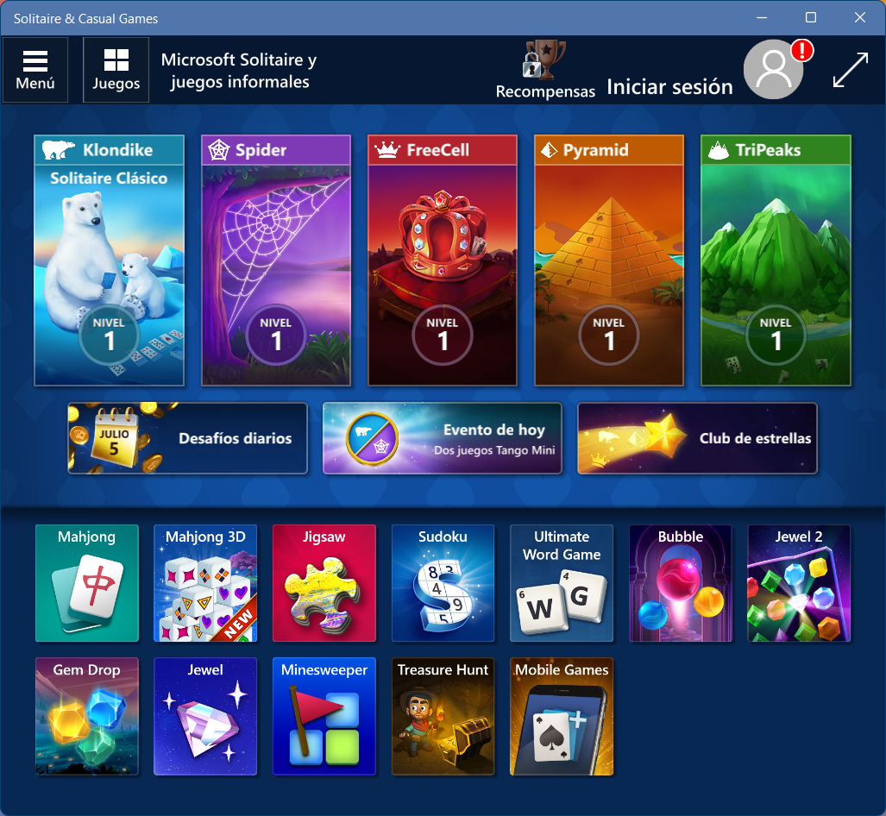

- **Reloj**: Incluye funciones de alarma, cronómetro, temporizador y reloj mundial para gestionar el tiempo de manera efectiva. En Windows 11, trae incorporado un control de sesiones de concentración para aplicar la [técnica Pomodoro 🍅](https://www.google.com/search?q=que+es+la+t%C3%A9cnica+pomodoro).

  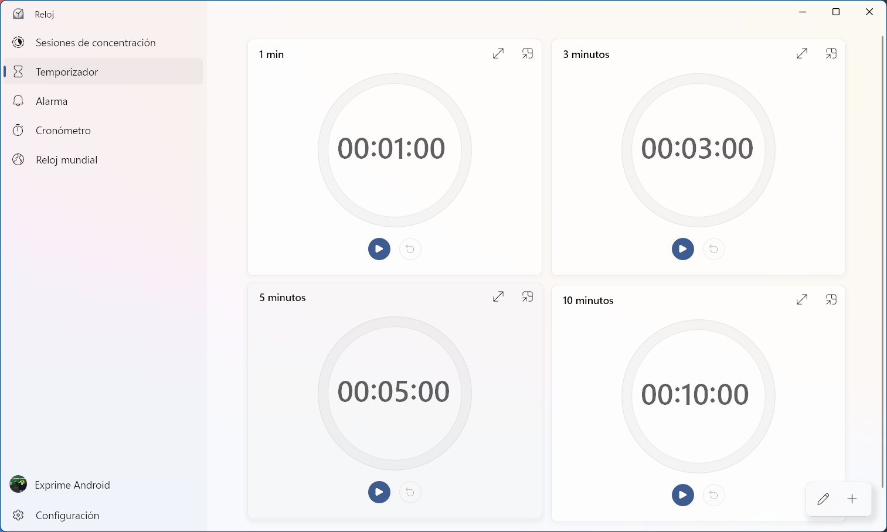

- **Configuración** / **Panel de control**: Centralizan todas las opciones de configuración del sistema, permitiendo personalizar y gestionar el funcionamiento de Windows.

  

  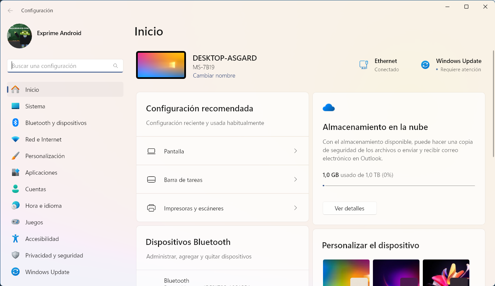

---

# Actualizaciones y mantenimiento

**Windows se actualiza automáticamente** para asegurar que tu sistema operativo esté siempre protegido y funcione de manera eficiente. Estas actualizaciones incluyen mejoras de seguridad, correcciones de errores, nuevas características y actualizaciones de controladores.

El servicio de **Windows Update se encarga de buscar, descargar e instalar** las actualizaciones automáticamente en segundo plano. No necesitas realizar ninguna acción manual para mantener tu sistema al día.

Aunque las actualizaciones se instalan automáticamente, puedes verificar manualmente si hay actualizaciones disponibles y forzar la instalación desde `Barra de Búsqueda > Windows Update (o Buscar actualizaciones)`.

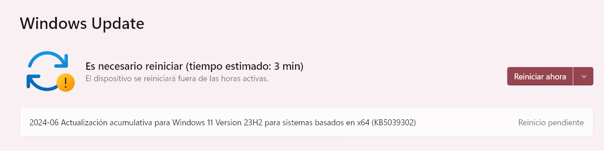

Si se instala alguna actualización que necesite reiniciar, te aparecerá un icono en la bandeja del sistema indicando que se ha descargado la actualización y está pendiente de reiniciar para poder instalarla. Si haces clic te lleva a la pantalla anterior.

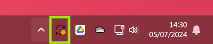

También, en el menú apagado, si hay actualizaciones pendientes aparecerán opciones para actualizar primero y reiniciar o apagar después.

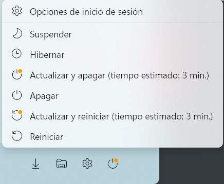
