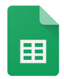

[TOC]

# Introducción a la Ofimática

## ¿Qué es la Ofimática?

{.rounded-4}

La ofimática se refiere al **conjunto de herramientas** y aplicaciones que se utilizan para **crear, editar, gestionar y compartir documentos electrónicos en un entorno de oficina**. 

Estas herramientas son esenciales para la productividad en entornos laborales y educativos, ya que facilitan tareas comunes como la redacción de textos, la creación de hojas de cálculo, la preparación de presentaciones y la gestión de correos electrónicos.

---

# Suites Ofimáticas

## 🟦 Microsoft 365

{.rounded-4}

**Microsoft 365**, anteriormente conocido como Office 365 (y antes Microsoft Office), es un **servicio de suscripción** de Microsoft que ofrece una suite completa de aplicaciones ofimáticas. Entre las aplicaciones más utilizadas se encuentran **Word**, **Excel**, **PowerPoint**, Outlook y OneNote. 

Microsoft 365 no solo proporciona acceso a estas aplicaciones en sus versiones más recientes, sino que también incluye almacenamiento en la nube a través de OneDrive, herramientas de colaboración como Microsoft Teams y actualizaciones continuas para mantener el software seguro y eficiente.

### Microsoft Word

**Microsoft Word** es una herramienta de procesamiento de textos que permite crear y editar documentos con una amplia gama de funcionalidades. Desde la redacción de informes hasta la creación de currículos profesionales, Word es una aplicación versátil y potente que facilita la elaboración de documentos de alta calidad.

### Microsoft Excel

**Microsoft Excel** es una aplicación de hoja de cálculo que permite organizar, analizar y visualizar datos de forma eficiente. Con funciones avanzadas de fórmulas, gráficos y tablas dinámicas, Excel es una herramienta indispensable para la gestión de datos, la contabilidad y el análisis financiero.

### Temario completo de Microsoft 365

<a href="https://curso-office365.netlify.app" target="_blank" style="display:inline-block; background-color:#0d6efd; color:#fff; padding:10px 18px; border-radius:6px; text-decoration:none; font-family:system-ui, -apple-system, 'Segoe UI', Roboto, 'Helvetica Neue', Arial, sans-serif; font-size:15px; font-weight:500; transition:background-color 0.2s ease;">
  Ir al curso de Microsoft 365
</a>

---

## 🟩 Google Workspace

Google ofrece su propia suite ofimática en la nube, integrada dentro de **Google Workspace** (anteriormente G Suite). Estas aplicaciones son totalmente gratuitas para usuarios con una cuenta de Google y permiten trabajar de forma colaborativa desde cualquier dispositivo con conexión a Internet. Sus principales herramientas son **Documentos de Google** y **Hojas de Cálculo de Google**, equivalentes a Word y Excel respectivamente.

### Documentos de Google

**Documentos de Google** es una aplicación de procesamiento de textos basada en la web que permite crear, editar y compartir documentos en línea. Ofrece herramientas avanzadas de edición, colaboración en tiempo real y guardado automático en la nube mediante **Google Drive**. Es ideal para trabajar en grupo o desde distintos dispositivos sin necesidad de instalar software.

> 🏠 [Página principal de Documentos de Google](https://www.google.es/intl/es/docs/about/)  
> 📄 [Crear un documento nuevo](https://docs.google.com/document/create?hl=es)

### Hojas de Cálculo de Google

**Hojas de Cálculo de Google** es una aplicación en línea para crear y gestionar hojas de cálculo colaborativas. Permite realizar cálculos, aplicar fórmulas, crear gráficos y compartir los archivos fácilmente con otros usuarios. Su principal ventaja es la **colaboración simultánea en tiempo real**, junto con la integración directa con Google Drive.

> 🏠 [Página principal de Hojas de Cálculo de Google](https://workspace.google.com/intl/es/products/sheets/)  
> 📄 [Crear una hoja de cálculo nueva](https://docs.google.com/spreadsheets/u/0/)
