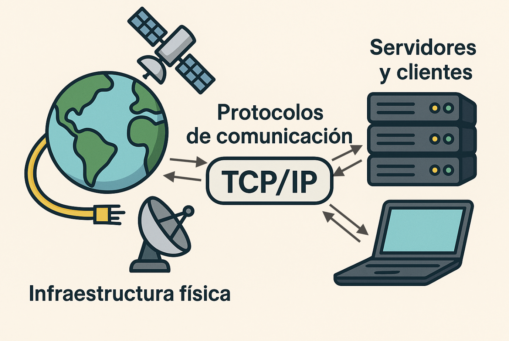

[TOC]

# 🌐Introducción a Internet

> [!note] Definición
>
> 📢**Internet** es una red global de computadoras interconectadas que permite la comunicación y el intercambio de información a nivel mundial. 

Es como una red gigantesca de carreteras digitales que conecta a personas, empresas, instituciones y gobiernos en todo el mundo.

{.rounded-4}

## Historia y Evolución

- **Orígenes**: Internet se originó en los años 60 como un proyecto de investigación del Departamento de Defensa de los Estados Unidos (ARPANET), con el objetivo de crear una red robusta y descentralizada que pudiera resistir a fallas y ataques.
- **Crecimiento**: En las décadas siguientes, Internet se expandió rápidamente a través de protocolos estándar como TCP/IP, que permiten la transmisión de datos de manera eficiente y confiable.
- **Web y navegadores**: En los años 90, la creación del World Wide Web (WWW) por Tim Berners-Lee marcó el inicio de la era moderna de Internet, facilitando el acceso a información mediante hipervínculos y páginas web. Los navegadores como Netscape Navigator y posteriormente Internet Explorer popularizaron el acceso fácil y visual a la web.
- **Expansión global**: En las últimas décadas, Internet ha crecido exponencialmente, conectando a más de 5.4 mil millones de personas en todo el mundo en 2024, [según estadísticas de la UIT](https://www.france24.com/es/minuto-a-minuto/20230913-un-tercio-de-la-poblaci%C3%B3n-mundial-sigue-privada-de-acceso-a-internet) (Unión Internacional de Telecomunicaciones).

## Funcionamiento Básico

{.rounded-4}

Internet funciona mediante una infraestructura física y lógica compleja:

- **📡Infraestructura física**: Consiste en cables de fibra óptica, satélites, antenas y otros medios de transmisión que permiten la interconexión global.
- **📣Protocolos de comunicación**: Los datos se transmiten a través de protocolos estándar como TCP/IP (Protocolo de Control de Transmisión/Protocolo de Internet), que aseguran la correcta transmisión y recepción de la información.
- **💻Servidores y clientes**: La información se almacena en servidores, que son computadoras especializadas, y se accede a ella mediante clientes como navegadores web y aplicaciones.

> [!TIP]
>
> Dentro del contexto de Internet, un protocolo es un **conjunto de reglas y estándares** que define cómo se **comunican y se intercambian datos** las computadoras conectadas a la red. Estas reglas aseguran que la información se transmita de manera eficiente, segura y comprensible entre dispositivos diferentes. 

## Importancia de Internet

Internet ha transformado la manera en que interactuamos, trabajamos, aprendemos y nos entretenemos. Sus principales beneficios incluyen:

- 🌐 **Acceso a la información**: Facilita el acceso instantáneo a una vasta cantidad de datos y conocimientos.  
- 💬 **Comunicación**: Permite la comunicación en tiempo real a través de correos electrónicos, redes sociales, videoconferencias, entre otros.  
- 💰 **Comercio y economía**: Impulsa el comercio electrónico y la globalización de los negocios.  
- 🎓 **Educación y aprendizaje**: Ofrece recursos educativos y plataformas de aprendizaje en línea accesibles desde cualquier lugar.  
- 💡 **Innovación y desarrollo**: Fomenta la innovación tecnológica y el desarrollo de nuevas aplicaciones y servicios.  

> [!tip] Pregunta
>
> 🧑‍🏫¿Podríamos mencionar un ejemplo real de cada beneficio que hemos nombrado?

---

# 🧭Navegadores Web

Los **navegadores web** son aplicaciones diseñadas para acceder y visualizar páginas web en Internet. Funcionan como intermediarios entre el usuario y la vasta cantidad de información disponible en la web. Algunos de los navegadores más populares incluyen Google Chrome, Mozilla Firefox, Microsoft Edge, Safari y Opera. Cada uno ofrece características únicas pero **todos comparten funciones básicas**:

- **Interfaz gráfica**: Permiten la navegación mediante una interfaz gráfica intuitiva que muestra páginas web y permite interactuar con ellas a través de clics, formularios, botones y otros elementos.
- **Motor de renderizado**: Interpretan el código HTML, CSS y JavaScript de las páginas web para mostrar contenido multimedia, como texto, imágenes, videos y animaciones.
- **Funcionalidades adicionales**: Incluyen características como la gestión de marcadores, la sincronización entre dispositivos, extensiones para ampliar funcionalidades y herramientas de seguridad.

## Los más populares

{.img-preview}

1. **Google Chrome**: Desarrollado por Google, es conocido por su velocidad, estabilidad y compatibilidad con numerosas extensiones. Es el navegador más utilizado a nivel mundial.
2. **Mozilla Firefox**: Conocido por su enfoque en la privacidad y la personalización. Es de código abierto y ofrece una amplia gama de extensiones para adaptarse a diferentes necesidades.
3. **Microsoft Edge**: Sucesor de Internet Explorer, Edge está integrado en el sistema operativo Windows y se destaca por su integración con servicios de Microsoft y su enfoque en la seguridad y la productividad.
4. **Safari**: El navegador predeterminado en los dispositivos Apple (Mac, iPhone, iPad). Es conocido por su rendimiento eficiente y su integración con el ecosistema Apple.
5. **Opera**: Ofrece características únicas como un VPN integrado, bloqueo de anuncios y un modo de ahorro de batería, lo que lo hace popular entre usuarios que valoran la privacidad y la eficiencia.

> [!tip] Pregunta
>
> 👩‍🏫¿Sabrías identificar a los navegadores mencionados en la imagen?

Aquí te dejamos una tabla con los principales navegadores y sus enlaces de descarga. También verás los usuarios aproximados de cada uno para que te hagas una idea de la popularidad de cada uno.

| **Nombre**           | **Descripción**                                              | **Dirección de descarga**        | **Nº de usuarios (aprox.)** |
| -------------------- | ------------------------------------------------------------ | -------------------------------- | --------------------------- |
| **Google Chrome**    | Navegador rápido y seguro con funciones inteligentes integradas de Google. | https://www.google.com/chrome/   | 3.200 millones              |
| **Safari**           | Navegador de Apple conocido por su velocidad y eficiencia en dispositivos iOS. | https://www.apple.com/safari/    | 1.000 millones              |
| **Microsoft Edge**   | Navegador de Microsoft basado en Chromium, optimizado para Windows 10 y 11. | https://www.microsoft.com/edge   | 600 millones                |
| **Firefox**          | Navegador de código abierto de Mozilla, enfocado en la privacidad y seguridad. | https://www.mozilla.org/firefox  | 300 millones                |
| **Opera**            | Navegador con bloqueador de anuncios integrado y VPN gratuita. | https://www.opera.com            | 80 millones                 |
| **Samsung Internet** | Navegador optimizado para dispositivos Samsung con funciones de privacidad. | https://www.samsung.com/internet | 400 millones                |
| **Brave**            | Navegador centrado en la privacidad con bloqueador de anuncios y rastreadores. | https://brave.com                | 50 millones                 |
| **Vivaldi**          | Navegador personalizable con herramientas avanzadas para usuarios expertos. | https://vivaldi.com              | 2 millones                  |
| **Tor**              | Navegador especializado en proteger al usuario del rastreo, la vigilancia y la censura. | https://www.torproject.org/es/   | 2 millones                  |

> [!note]
>
> Muchos navegadores deben su popularidad y número de usuarios debido a que vienen preinstalados en muchos dispositivos, ya sean del fabricante o por acuerdos con otros fabricantes.

## Funciones principales

- **Navegación por pestañas**: Permite abrir varias páginas web en una sola ventana y cambiar fácilmente entre ellas.

  {.rounded-3}

- **Barra de direcciones**: Donde se introduce la URL (*Uniform Resource Locator*) de la página web a la que se quiere acceder.

  {.rounded-3}

- **Marcadores y historial**: Facilitan guardar y organizar páginas web favoritas y acceder rápidamente al historial de navegación. Las web favoritas suelen llamarse **marcadores** o **favoritos** y suelen tener asociado el icono de una estrella ⭐.

  {.rounded-3}

- **Privacidad y seguridad**: Incluyen funciones como bloqueo de ventanas emergentes, protección contra sitios web maliciosos y la opción de navegar de forma privada (modo incógnito).

  {.rounded-3}

## 👩‍🏫Práctica

Vamos a practicar un poco con nuestro navegador.

1. Abre el navegador que tengas instalado en tu PC. Recuerda que Edge está instalado en todos.
2. Abre en una pestaña el temario del curso, <kbd>curso-competencias-digitales.netlify.app</kbd>. Abre en otra pestaña otra dirección, por ejemplo <kbd>curso-office365.netlify.app</kbd>. Recuerda que tendrás que escribir la dirección manualmente o copia y pega en la barra de direcciones.
3. Deberás tener (como mínimo) dos pestañas abiertas simultáneamente, cada una con una web distinta. Observa como puedes cambiar de una a otra.
4. Guarda las páginas en favoritos. Cada navegador tiene su forma, por lo que deberás investigar como se hace.
5. Cierra las pestañas y por último el navegador. Vuelve a abrir el navegador y usa los favoritos para acceder de nuevo a las web. Así no tendrás que escribirlas cada vez que tengas que ir al temario.

​              

## Descargas

Las descargas en los navegadores web permiten a los usuarios **guardar archivos desde Internet en sus dispositivos locales**. Este proceso sigue una serie de pasos que aseguran la integridad y la seguridad de los archivos descargados:

1. **Iniciando una Descarga:** Cuando un usuario decide descargar un archivo desde una página web, generalmente lo hace al **hacer clic en un enlace** de descarga o un botón específico. Esto le indica al navegador que debe transferir el archivo desde el servidor remoto a su dispositivo local.
2. **Gestión de Descargas:** El navegador **gestiona las descargas mostrando información relevante al usuario**, como el tamaño del archivo y el tiempo estimado de descarga. También permite al usuario elegir la ubicación donde desea guardar el archivo descargado en su dispositivo. Normalmente, suele descargarse por defecto en la carpeta `Descargas`.
3. **Proceso de Transferencia:** Durante la descarga, **el navegador establece una conexión con el servidor** remoto a través del protocolo HTTP, HTTPS u otros protocolos dependiendo del tipo de contenido. Utiliza el protocolo de transferencia de archivos adecuado para asegurar que los datos se transmitan de manera íntegra y eficiente. Tranquilidad, el navegador lo hará por tí 😏.
4. **Verificación y Seguridad:** Los navegadores modernos realizan verificaciones de seguridad automáticas durante las descargas para proteger al usuario contra archivos maliciosos. Esto incluye análisis de virus y malware, así como la comprobación de la autenticidad de los certificados de seguridad de la página web desde donde se realiza la descarga.
5. **Descarga completada:** Una vez completada la descarga, el navegador notifica al usuario, generalmente con una notificación emergente o mediante un icono específico en la interfaz. El archivo descargado está disponible en la ubicación especificada por el usuario para su acceso inmediato.

> [!TIP] 
>
> 🧑‍🏫Prueba a descargar la imagen anterior (la del proceso de descarga) haciendo sobre la imagen`Clic derecho` > `Guardar imagen como...`. 
>
> Así podrás probar como se descarga y se guarda el archivo en tu equipo. También puedes descargar cualquier navegador que explicamos en el punto anterior.

## Búsquedas

Realizar una búsqueda en Internet es un proceso sencillo que te permite encontrar información específica en la web. Veremos como hacerlo:

1. **Abrir un Navegador**: Inicia tu navegador web favorito, como Google Chrome, Firefox, Safari o cualquier otro.

2. **Ingresar la Consulta**: En la barra de direcciones o en el campo de búsqueda del navegador, escribe lo que estás buscando. Por ejemplo, "recetas de cocina", "mejores destinos para vacaciones", o "cómo aprender programación".

   {.rounded-3}

3. **Presionar Enter o Hacer Clic en Buscar**: Una vez que hayas escrito tu consulta, presiona la tecla <kbd>Enter</kbd> en tu teclado o haz clic en el botón de búsqueda (generalmente una lupa) en la barra de búsqueda.

4. **Ver los Resultados**: El navegador te mostrará una página con una lista de resultados relevantes a tu búsqueda. Cada resultado incluirá un título, una breve descripción y una URL que te llevará al sitio web correspondiente.

   {.rounded-3}

5. **Explorar los Resultados**: Puedes hacer clic en cualquier resultado para abrir la página web y encontrar más información sobre el tema que buscas. Normalmente se ofrecerán resultados más relevantes agrupados por: `Todo`, `Imágenes`, `Vídeos`, `Noticias`, etc. En nuestro ejemplo, como hemos buscado algo visual, directamente nos ha mostrado inicialmente `Imágenes`, y después ha mostrado `Noticias` (aunque no se ven en la captura).

> [!tip]
>
> Si buscas en Google, puedes probar el nuevo Modo IA.
>
> 

### Consejos para una Búsqueda Efectiva

Muchas veces buscar algo concreto en Internet es como entrar a una selva profunda sin machete. Encontrarás muchisimos resultados que no son los que tu estás buscando, por lo que tendrás que filtrar entre mucha maleza la información que quieres. Siempre encontraremos información que no queremos, pero es importante seguir los siguientes consejos para aumentar las posibilidades de encontrar lo que queremos.

{.rounded-3}

- **💡Utiliza Palabras Clave**: Usa términos específicos relacionados con lo que estás buscando. Evita las generalizaciones o ambigüedades.  
  👉 *Ejemplo:* En lugar de buscar “animales”, escribe “hábitat del lobo ibérico” o “alimentación de los delfines”.  

- **🔎Refina tu Búsqueda**: Si los resultados no son lo que esperabas, prueba agregar más detalles a tu consulta.  
  👉 *Ejemplo:* Si al buscar “historia del arte” obtienes resultados muy amplios, prueba con “historia del arte renacentista italiano”.  

- **🪚Filtra los Resultados**: Algunos motores de búsqueda te permiten usar filtros para encontrar resultados más específicos, como imágenes, videos o noticias.  
  👉 *Ejemplo:* En Google, puedes hacer clic en “Imágenes” o “Noticias” después de buscar, o usar herramientas de tiempo para mostrar solo resultados recientes.  

### Motores de búsqueda

Los motores de búsqueda son sistemas informáticos diseñados para ayudar a los usuarios a encontrar información específica en la vasta red de Internet. Utilizan algoritmos complejos para rastrear y catalogar contenido web, permitiendo a los usuarios buscar términos clave y recibir resultados relevantes en cuestión de segundos.

> [!important]
>
> Mientras que un navegador web es la herramienta que utilizas para acceder y explorar Internet, **un motor de búsqueda es la herramienta que utilizas dentro del navegador para encontrar información** específica en la web.

Normalmente cada navegador tiene su motor de búsqueda predeterminado pero siempre pueden cambiarse de una forma u otra. A veces de una forma rebuscada dentro de sus opciones de configuración, u otras veces lo hacen de forma obligada debido a la [Ley de Mercados Digitales (DMA) de la Unión Europea](https://computerhoy.com/tecnologia/chrome-te-obligara-elegir-motor-busqueda-favorito-partir-fecha-1347506), que intenta evitar prácticas anticompetitivas por parte de grandes empresas tecnológicas.

{.rounded-4}

> [!WARNING]
>
> Microsoft Edge usa Bing como motor de búsqueda predeterminado. Google Chrome usaba Google hasta que le obligaron a que mostrara unos cuántos motores de búsqueda y dejara al usuario decidir cual quiere usar.

Según el motor de búsqueda que uses podrás obtener mejores o peores resultados. Unos recopilan más información que otros por lo que pueden afinar más los resultados que otros. Generalmente con Google obtendrás los mejores resultados pero también cedes mucha información a cambio. La elección es tuya ⚖️.

---

# 📧Correo electrónico

El **correo electrónico** es un método de comunicación digital que permite a los usuarios enviar y recibir mensajes a través de Internet. Es una de las formas más antiguas y ampliamente utilizadas de comunicación en línea, esencial para la correspondencia personal y profesional.

{.rounded-4}

## Servicios de correo electrónico más usados

A continuación, se presenta una tabla con los servicios de correo electrónico más populares, una breve descripción de cada uno y un enlace para crear una cuenta:

| **Servicio**   | **Descripción**                                              | **Enlace para Crear Cuenta**                                 |
| -------------- | ------------------------------------------------------------ | ------------------------------------------------------------ |
| **Gmail**      | **Ofrecido por Google**, conocido por su interfaz intuitiva y su integración con otros servicios de Google como Google Drive y Google Calendar. Si tienes un móvil android, tienes obligatoriamente una cuenta de GMail. | [Crear cuenta de Google](https://accounts.google.com/signup) |
| **Outlook**    | **Ofrecido por Microsoft**, integra funciones de calendario, contactos y tareas, y es compatible con las aplicaciones de Office 365. Anteriormente conocido como Hotmail 👴👵. | [Crear cuenta de Microsoft](https://signup.live.com)         |
| **Yahoo Mail** | **Ofrecido por Yahoo**, proporciona una amplia capacidad de almacenamiento y una interfaz fácil de usar. | [Crear cuenta en Yahoo Mail](https://login.yahoo.com/account/create) |
| **ProtonMail** | Conocido por su enfoque en la seguridad y privacidad, ofrece cifrado de extremo a extremo para proteger los correos electrónicos. | [Crear cuenta en ProtonMail](https://account.proton.me/es-es/signup) |
| **Apple Mail** | Parte del **ecosistema Apple**, permite sincronización con otros dispositivos Apple y servicios como iCloud. | [Crear cuenta en iCloud](https://appleid.apple.com/account)  |

> [!IMPORTANT]
>
> Una **cuenta de Google** te permite acceder a una variedad de servicios proporcionados por Google, como Google Drive, Google Calendar, Google Photos, y más. 
>
> Por otro lado, una **cuenta de Gmail** es específicamente para gestionar tus correos electrónicos. Sin embargo, cuando creas una cuenta de Gmail, automáticamente obtienes una cuenta de Google, lo que te da acceso a todos los servicios de Google. 
>
> **Es decir, una cuenta de Gmail es una cuenta de Google con acceso adicional a Gmail.**
>
> Pasa lo mismo con una cuenta de Microsoft y el correo de Outlook (o Hotmail).

## Glosario de Términos Básicos

Cada servicio de correo electrónico tiene su propia interfaz y características específicas, pero **todos comparten ciertos elementos comunes** que son fundamentales para el funcionamiento y la gestión de los correos electrónicos. 

A continuación, se describen los términos básicos que encontrarás en casi todos los servicios de correo electrónico, lo que te ayudará a comprender y utilizar cualquier plataforma de manera más efectiva.

- **Destinatario (Para)**: La persona o personas a las que se envía el correo electrónico. Se introduce la dirección de correo del destinatario en el campo "Para".

- **Asunto**: El título o tema del correo electrónico. Debe ser breve y descriptivo para dar una idea clara del contenido del mensaje.

- **CC (Con Copia)**: Campo donde se introducen las direcciones de correo de personas que deben recibir una copia del correo electrónico. Todos los destinatarios pueden ver a quiénes más se ha enviado el mensaje.

- **CCO (Con Copia Oculta)**: Similar al campo CC, pero las direcciones de correo en el campo CCO son ocultas a los demás destinatarios. Se usa para proteger la privacidad de las direcciones de correo.

- **Cuerpo del Mensaje**: La parte principal del correo electrónico donde se escribe el mensaje. Puede incluir texto, imágenes, enlaces y otros elementos multimedia.

- **Archivos Adjuntos**: Archivos adicionales que se envían junto con el correo electrónico. Pueden ser documentos, imágenes, videos, entre otros. Los archivos adjuntos se agregan a través de una opción específica en la interfaz de correo electrónico. Normalmente suelen admitir “arrastrar y soltar” archivos.

**Ejemplo de ventana de redacción de un correo electrónico en Gmail**

{.rounded-4}

**Ejemplo de ventana de redacción de un correo electrónico en Outlook**

{.rounded-4}

## Agrupaciones más comunes

La mayoría de los servicios de correo electrónico **organizan los mensajes en diferentes carpetas o agrupaciones** para facilitar su gestión y acceso. Aquí tienes una lista de las agrupaciones de correo más comunes:

- 📥**Bandeja de Entrada**: Donde se almacenan los correos electrónicos recibidos. Es la carpeta principal que revisas para ver nuevos mensajes.

- 📤**Bandeja de Salida**: Almacena temporalmente los correos electrónicos que están en proceso de ser enviados. Una vez enviados, se trasladan a la carpeta de "Enviados".

- 📨**Enviados**: Contiene todos los correos electrónicos que has enviado. Te permite revisar los mensajes que has enviado a otros destinatarios.

- 📝**Borradores**: Guarda los correos electrónicos que has comenzado a escribir pero aún no has enviado. Puedes volver a ellos para completarlos y enviarlos más tarde.

- 🚫**Spam**: Almacena correos electrónicos que el servicio ha identificado como correo no deseado o potencialmente malicioso. Es recomendable revisar esta carpeta ocasionalmente para asegurarte de que no contiene correos importantes.

- 🗑️**Papelera**: Contiene los correos electrónicos que has eliminado. Los mensajes en la papelera se pueden recuperar temporalmente antes de ser eliminados definitivamente.

- 🗄️**Archivados**: Permite almacenar correos electrónicos que ya no necesitas en tu bandeja de entrada pero que deseas conservar para futuras referencias. Los mensajes archivados no se eliminan.

- ❗**Importantes**: Algunos servicios permiten marcar correos electrónicos como importantes para destacarlos y acceder a ellos fácilmente.

- 🗃️**Etiquetas o Categorías**: Algunos servicios permiten etiquetar o categorizar correos electrónicos para una mejor organización. Las etiquetas pueden personalizarse según las necesidades del usuario.

Estas agrupaciones ayudan a mantener tu correo electrónico organizado, facilitando la gestión y acceso a los mensajes según su estado y relevancia.

---

# ✨Inteligencia Artificial

La inteligencia artificial (IA) es una rama de la informática que se dedica a crear sistemas capaces de realizar tareas que normalmente requieren inteligencia humana. Estas tareas incluyen el reconocimiento de voz, la toma de decisiones, la traducción de idiomas y mucho más.

## Inteligencia Artificial Generativa

La **inteligencia artificial generativa** es una rama de la IA que se centra en la **creación de contenido nuevo** y original a partir de datos existentes. Utiliza modelos avanzados de aprendizaje automático para **generar texto, imágenes, música, videos y más**. Por ejemplo, puede escribir un poema, crear una obra de arte digital o componer una melodía.

{.img-preview}

> [!TIP]
>
> ***Théâtre d'Opéra Spatial*** (Teatro de Ópera Espacial) es una pintura creada por Jason M. Allen utilizando la plataforma de Inteligencia Artificial generativa [Midjourney](https://es.wikipedia.org/wiki/Midjourney). La pintura se convirtió en noticia cuando ganó el concurso anual de bellas artes de la Feria Estatal de Colorado el 5 de septiembre de 2022, convirtiéndose en una de las primeras imágenes generadas por IA en ganar un premio.

Esta tecnología es especialmente útil en aplicaciones como los **chatbots**, la creación de contenido multimedia y el diseño de productos, ya que puede producir resultados creativos y personalizados en respuesta a las indicaciones del usuario.

Podemos destacar varios chatbots gratuitos (con modelos de pago superiores mejorados) que podemos usar para realizar tareas cotidianas y en el trabajo. De todos ellos podremos realizar las siguientes tareas (cada uno a su forma):

- **Asistencia en la redacción**: pueden ayudar a escribir correos electrónicos, artículos, informes y otros documentos, proporcionando sugerencias y completando frases.
- **Resolución de dudas**: Al igual que una búsqueda en internet, pueden responder preguntas de manera directa y concisa, ahorrando tiempo al no tener que filtrar información.
- **Aprendizaje y educación**: Puede explicar conceptos complejos de manera sencilla, lo que lo convierte en una herramienta útil para estudiantes y profesores.
- **Atención al cliente**: pueden ser utilizados en proporcionar soporte y resolver consultas comunes de los clientes de manera eficiente.
- **Traducción de idiomas**: pueden traducir textos de un idioma a otro de manera precisa.
- **Generar código:** pueden ayudarte a programar. Entienden y generan código en multitud de lenguajes de programación.
- **Aplicaciones móviles:** Todos poseen su respectiva aplicación móvil para tener todo el conocimiento en la palma de tu mano 🤓.

### Chat GPT

ChatGPT es un modelo de lenguaje avanzado desarrollado por OpenAI. Utiliza inteligencia artificial para generar texto de manera coherente y natural en respuesta a las preguntas y solicitudes de los usuarios. Actualmente está basado en la arquitectura GPT-4, aunque también ofrece versiones anteriores como GPT-3.5, y puede realizar una gran variedad de tareas relacionadas con el lenguaje y el razonamiento.

> 🤖Página web https://chatgpt.com/

- Usa GPT-4 de OpenAI (en su versión Plus), aunque también está disponible GPT-3.5.
- Puede acceder a información actualizada mediante búsqueda web en tiempo real, lo que le permite ofrecer respuestas basadas en datos recientes cuando es necesario.
- Dispone de un modo llamado *Deep Research*, que permite realizar investigaciones más profundas, con respuestas extensas, citadas y respaldadas con fuentes verificables. Este modo es ideal para trabajos académicos o tareas complejas que requieren rigor informativo.
- Puede generar imágenes a partir de descripciones escritas utilizando el modelo DALL·E, ideal para ilustraciones, conceptos visuales, diseño y creatividad.

### Microsoft Copilot

Microsoft Copilot es una herramienta de inteligencia artificial integrada en aplicaciones de Microsoft 365 como Word, Excel, Outlook, PowerPoint y Teams. Asiste a los usuarios en la redacción, análisis de datos, generación de contenido, automatización de tareas y mejora de la productividad en el entorno laboral.

> 🤖 Página web https://copilot.microsoft.com

- Utiliza el modelo GPT-4 de OpenAI, integrado a través de la infraestructura de Azure AI.
- Tiene acceso a información actualizada en tiempo real desde Bing, por lo que puede responder sobre eventos recientes o datos del momento.
- Puede generar imágenes a partir de texto mediante el modelo [Dall·E](https://es.wikipedia.org/wiki/Dall-e) 3.
- También puede interpretar y describir imágenes cargadas por el usuario, útil en presentaciones o análisis visuales.
- Está profundamente integrado en el ecosistema de Microsoft, por lo que puede trabajar directamente con tus documentos, hojas de cálculo o correos electrónicos.

### Google Gemini

Google Gemini es una plataforma de IA desarrollada por Google que se enfoca en la generación de texto y la comprensión del lenguaje natural. Es útil para obtener respuestas rápidas y precisas a preguntas específicas. Tiene la ventaja de integrarse en todo el ecosistema de aplicaciones de Google.

> 🤖Página web https://gemini.google.com/

- Tiene su propio modelo de lenguaje desarrollado por Google, llamado **Gemini**. Este modelo se basa en la familia de modelos **PaLM 2**, de Google AI, y no utiliza GPT de OpenAI.

- Puede describir imágenes.

  

- Se puede instalar como asistente de voz en un dispositivo móvil. Puedes [encontrarlo en la tienda de aplicaciones de android](https://play.google.com/store/apps/details?id=com.google.android.apps.bard).

### Perplexity

Perplexity es un asistente de inteligencia artificial centrado en la búsqueda de información con fuentes verificables. Combina modelos de lenguaje avanzados con acceso en tiempo real a internet, ofreciendo respuestas claras, concisas y siempre acompañadas de referencias. Está diseñado especialmente para quienes necesitan respuestas confiables y actualizadas rápidamente.

> 🤖 Página web https://www.perplexity.ai/

- Utiliza modelos como GPT-4 y Claude de forma integrada.
- Realiza búsquedas en internet en tiempo real y muestra las fuentes utilizadas directamente en sus respuestas.
- Ideal para estudiantes, periodistas, investigadores o cualquier usuario que necesite verificar la información de forma inmediata.
- Tiene un diseño enfocado en la simplicidad: se usa como un motor de búsqueda, pero con capacidades de lenguaje natural.
- Ofrece un modo “Pro” con respuestas más detalladas y acceso a modelos premium.