# Índice

[TOC]

------

# 👮Seguridad Informática

En la era digital actual, la seguridad informática es crucial **tanto en el ámbito personal como laboral**. Proteger nuestros datos personales y profesionales de amenazas cibernéticas se ha vuelto esencial para evitar pérdidas económicas, robo de identidad y otros daños. Conocer los conceptos básicos de seguridad informática nos permite tomar medidas preventivas y reaccionar adecuadamente ante posibles incidentes.

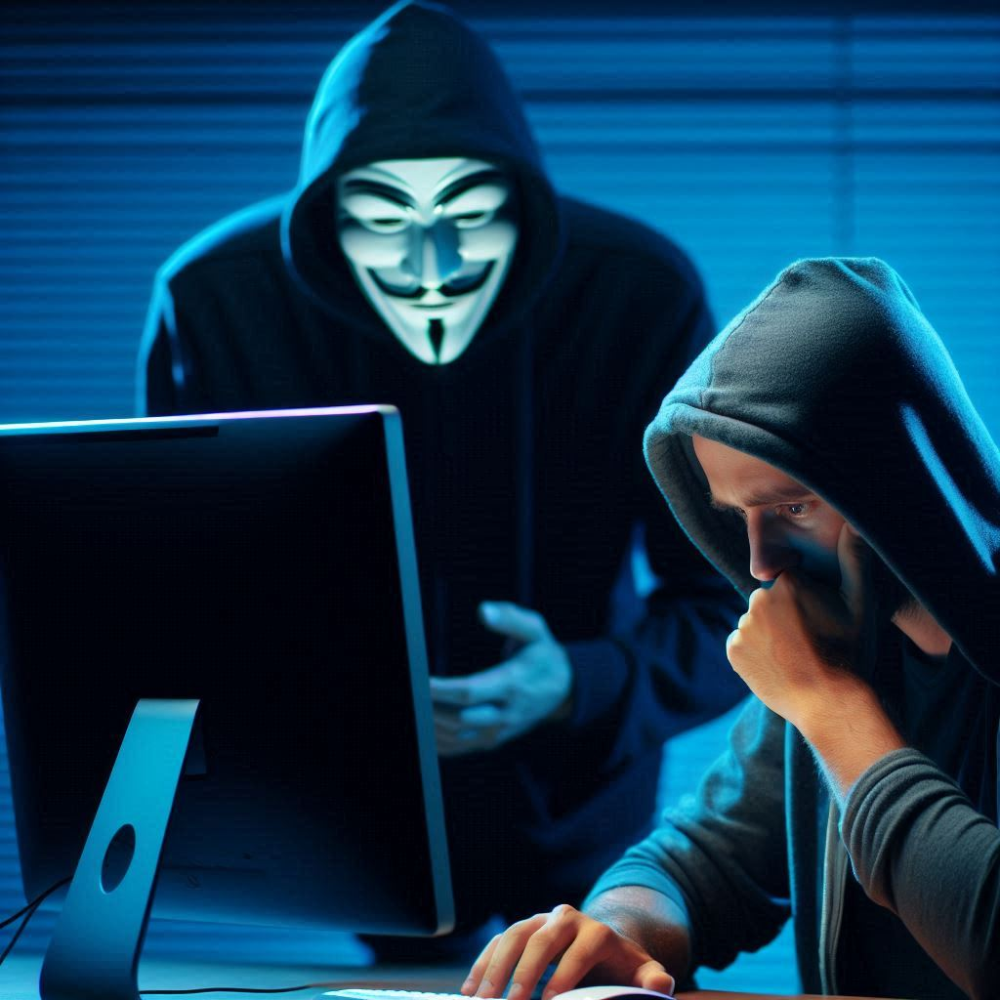

# 🔑Contraseñas Seguras

Las contraseñas **son la primera línea de defensa** contra accesos no autorizados a nuestras cuentas. Una contraseña segura reduce significativamente el riesgo de que nuestros datos sean comprometidos.

## Características de una contraseña segura

- **Longitud**: Al menos 12 caracteres.
- **Combinación de caracteres**: Usar una mezcla de letras mayúsculas y minúsculas, números y símbolos.
- **No usar información personal**: Evitar usar nombres, fechas, palabras comunes e información personal que mucha gente pueda saber. Recuerda que todo el que te conozca puede saber cuando naciste o el nombre de tu mascota.
- **Únicas para cada cuenta**: No reutilizar la misma contraseña en diferentes servicios. Todos los días salen en las noticias que una compañía ha sido hackeada. Si cae una contraseña caen todas.

> [!CAUTION]
>
> Usar `12345` o `superman` es una [muy mala idea](https://www.lavanguardia.com/cribeo/geek/20150121/47345514106/123456-o-superman-en-la-lista-de-las-contrasenas-mas-utilizadas-y-menos-seguras.html). De todas formas, en la actualidad ningún servicio te dejaría usar esas contraseñas.

## Consejos para gestionar contraseñas

- **Utilizar un gestor de contraseñas**: Herramientas como LastPass o 1Password pueden generar y almacenar contraseñas seguras.
- **Cambiar contraseñas regularmente**: Actualizar las contraseñas cada cierto tiempo.
- **Activar la Autenticación de Dos Factores (2FA)**: Añade una capa extra de seguridad al requerir una segunda forma de verificación.

## Autenticación multifactor

Es un sistema en el que los usuarios se autentican mediante la presentación de múltiples piezas de información u objetos. **Un sistema multifactor** **debería de pedirte al menos dos** de los siguientes elementos:

- 💭 **Algo que sabes**: Una contraseña o un pin.
- 🔑 **Algo que tienes**: Algo físico, como un pendrive, una llave, una tarjeta física (bancaría o de acceso), un número de teléfono. 
- 🩻 **Algo que eres**: Alguna lectura biométrica, como la huella dactilar, escáner de retina o reconocimiento facial.

Es un componente de seguridad muy importante, ya que si sólo se usan contraseñas, pueden ser susceptibles de ser atacadas de muchas formas. Al ser los distintos factores de distintas naturalezas, sería mucho más complejo obtener varios de ellos simultáneamente.

Es el sistema que usan los bancos (contraseña + SMS) o las cuentas de compañías como Google, Microsoft o Amazon para iniciar sesión en sus servicios. Normalmente encontrarás las opciones para activarlas en la configuración de seguridad o privacidad de cada servicio.

    <a href="https://play.google.com/store/apps/details?id=com.google.android.apps.authenticator2&hl=es" target="_blank" style="
        display: inline-block;
        padding: 10px 20px;
        margin: 30px;                                                                                                                     font-family: Arial, sans-serif;
        font-size: 14px;
        font-weight: bold;
        color: #ffffff;
        background-color: #34B793;
        border: none;
        border-radius: 4px;
        text-align: center;
        text-decoration: none;
        transition: background-color 0.3s ease;
        -webkit-transition: background-color 0.3s ease;
        -moz-transition: background-color 0.3s ease;
        -o-transition: background-color 0.3s ease;
    " onmouseover="this.style.backgroundColor='#2C8C42';" onmouseout="this.style.backgroundColor='#34A853';">
        
        Aplicación Google Authenticator
    </a>
    <a href="https://play.google.com/store/apps/details?id=com.azure.authenticator&hl=es" target="_blank" style="
        display: inline-block;
        padding: 10px 20px;
        margin: 30px;
        font-family: Arial, sans-serif;
        font-size: 14px;
        font-weight: bold;
        color: #ffffff;
        background-color: #34B793;
        border: none;
        border-radius: 4px;
        text-align: center;
        text-decoration: none;
        transition: background-color 0.3s ease;
        -webkit-transition: background-color 0.3s ease;
        -moz-transition: background-color 0.3s ease;
        -o-transition: background-color 0.3s ease;
    " onmouseover="this.style.backgroundColor='#2C8C42';" onmouseout="this.style.backgroundColor='#34A853';">
        
        Aplicación Microsoft Authenticator
    </a>

> [!IMPORTANT]
>
> Asegúrate de añadir métodos de recuperación a tus cuentas importantes (teléfonos y correos alternativos). Si algún día tienes problemas para iniciar sesión, te serán de mucha ayuda para poder recuperar tu cuenta. 
>
> 🚨**MUY IMPORTANTE**: Y sobre todo mantenerlos actualizados. No nos sirve de nada tener como método de recuperación el teléfono aquel que dimos de baja hace 3 años o el correo de tu expareja.

# 🤷Usuarios

En muchas ocasiones, **el usuario es considerado el eslabón más débil en la cadena de seguridad informática**. Esto se debe a que, sin importar cuán avanzadas sean las medidas de seguridad implementadas, un simple error humano puede comprometer la integridad de un sistema. Por lo tanto, es crucial que los usuarios tomen conciencia de su papel y responsabilidad en la protección de la información.

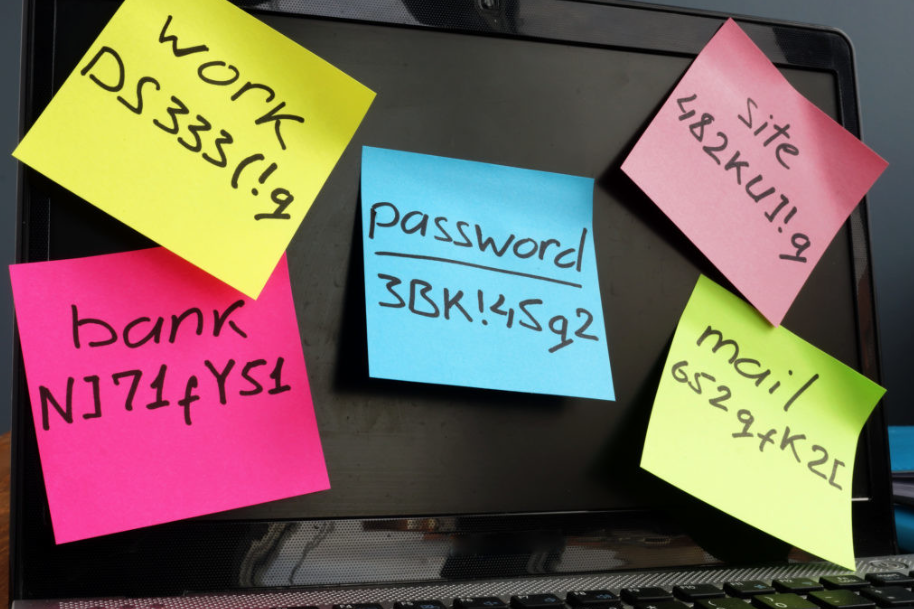

Tanto en el uso de equipos privados como en entornos laborales, los usuarios deben adoptar ciertas prácticas y comportamientos para fortalecer la seguridad:

**Conceptos básicos:**

- **🚨⚠️DESCONFÍA ABSOLUTAMENTE DE TODO⚠️🚨:** Sea lo que sea, casi seguro que es mentira. Todo. Desconfía de cualquier mensaje, SMS, correo, noticia o aplicación que haya en internet.

- **Ser precavidos con los correos electrónicos**: Desconfiar de correos no solicitados, especialmente aquellos que solicitan información personal o financiera. Siempre verificar la autenticidad del remitente antes de tomar cualquier acción.

- **Navegar con precaución**: Evitar visitar sitios web sospechosos o descargar archivos de fuentes no confiables. Utilizar navegadores con filtros de seguridad activados.

- **Mantener la información confidencial**: No compartir contraseñas ni información sensible a través de canales inseguros. Utilizar métodos de comunicación cifrados para datos críticos.

- **Actualizar regularmente**: Asegurarse de que el sistema operativo, aplicaciones y programas de seguridad estén siempre actualizados. Las actualizaciones suelen incluir parches que corrigen vulnerabilidades conocidas.

- **Utilizar herramientas de seguridad**: Instalar y mantener activo un software antivirus y antimalware. Configurar firewalls para monitorear el tráfico entrante y saliente.

- **Ser cuidadosos con los dispositivos físicos**: No dejar dispositivos como portátiles, teléfonos móviles o USB desatendidos en lugares públicos. Proteger los dispositivos con contraseñas o métodos de autenticación biométrica.

  

# 🎣Fraudes y Phishing

El phishing es una **técnica utilizada por ciberdelincuentes para engañar a las personas** y obtener información confidencial, como contraseñas o datos bancarios, haciéndose pasar por entidades confiables.

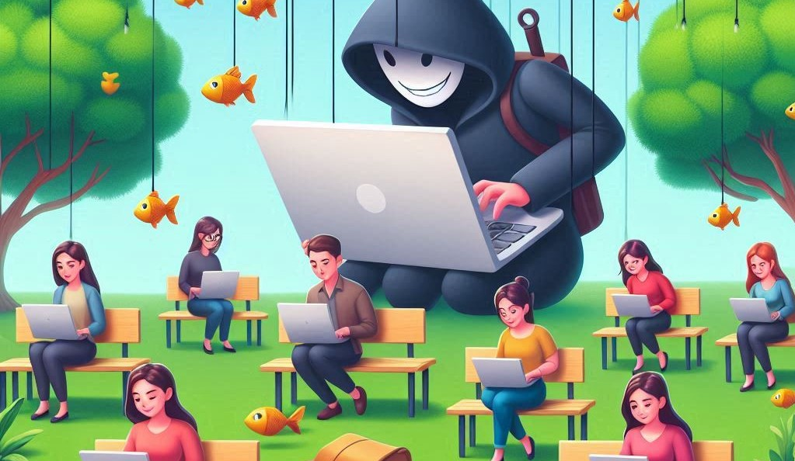

## Cómo reconocer un intento de phishing

- **Remitente desconocido**: Correos de remitentes desconocidos o sospechosos.
- **Errores ortográficos y gramaticales**: Mensajes con errores son una señal de alerta.
- **Enlaces sospechosos**: Enlaces que no coinciden con la URL oficial de la entidad.
- **Solicitudes urgentes**: Mensajes que crean un sentido de urgencia para tomar acciones inmediatas. Piensa con frialdad y recuerda desconfiar DE TODO.

**Ejemplo:**

Recibes un SMS con el siguiente texto:

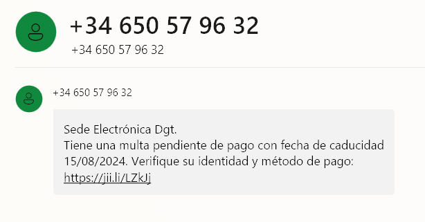

Pulsamos sobre el enlace que aparece en el SMS, aunque sea una dirección un poco rara, pero tengo un mes para pagar la multa. Nos lleva a la siguiente página.

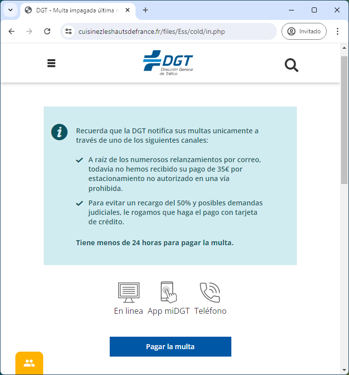

Aparente estoy en la web de la DGT, aunque su URL es un poco rara. ¡Ahora resulta que tengo 24 horas para pagar la multa! Empiezan los nervios. Y claro, como son “solo” 35€, pues tendremos que pagarla. Pulsamos en “Pagar la multa”

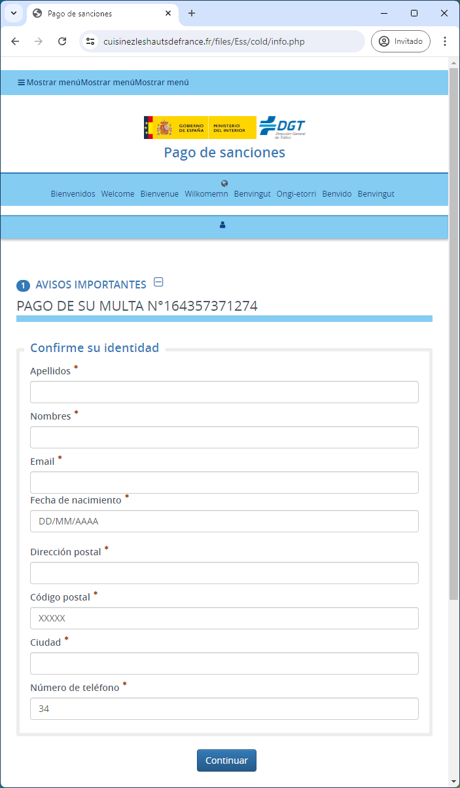

Para ser la DGT y haberme puesto una multa, me están pidiendo demasiados datos que ya deberían de tener. No me piden la matrícula del coche, que raro. También la página tiene elementos raros por la parte de arriba, pero como estoy nervioso no me doy cuenta de esos detalles. Solo quiero pagar la multa y que termine el infierno. Me invento todos los datos y pulso “Continuar”. ¿Porqué me deja continuar si me inventé todos los datos?

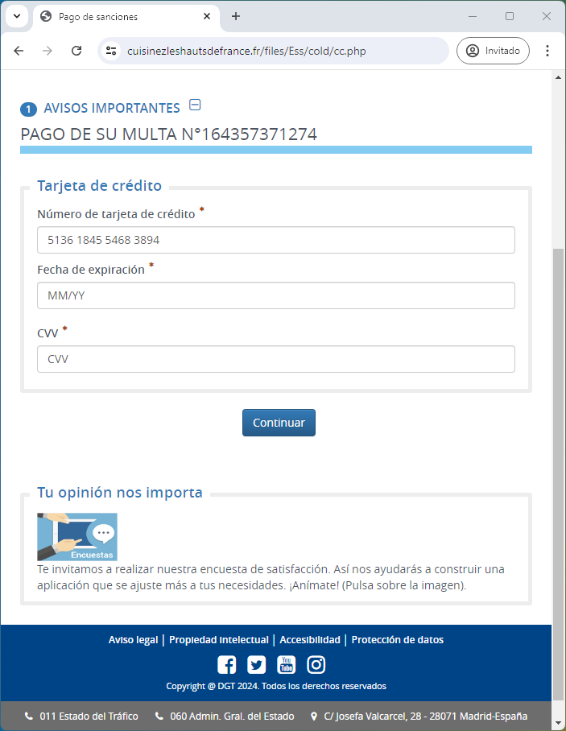

Llegamos al ansiado tesoro. Los datos de mi tarjeta de crédito. Obviamente le pondré los datos correctos para que me cobren la multa, no vaya a ser que tenga que pagar más.

Al continuar al siguiente paso dará error. Siempre. Y puedes revisarlo mil veces que los datos son los correctos. Pero resulta que ese formulario ha enviado los DATOS VÁLIDOS de mi tarjeta de crédito a otra persona muy mala, que puedes dar por hecho que intentará hacer compras en cualquier negocio online con esos datos. Ya puedes darla de baja lo más rápido posible.

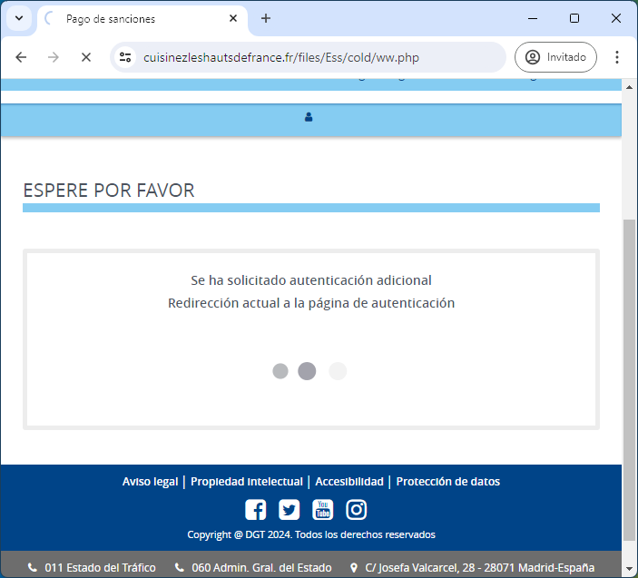

> [!CAUTION]
>
> Para usar una tarjeta de crédito en internet, solo es necesario el número, la fecha de expiración y el CVV. Los bancos modernos suelen usar otros medios de seguridad como confirmación a través de su app para autorizar compras online o bien limitar las compras a internet, extranjero, cajeros, etc.

## Cómo protegerse del phishing

- **No hacer clic en enlaces sospechosos**: Verificar la URL antes de hacer clic. Además, los enlaces pueden tener un texto y llevar a otra página. Ejemplo: [https://www.bbva.es](https://www.dametodoloquetengasoterajo.com).
- **No compartir información sensible**: Nunca proporcionar datos personales o financieros a través de correos electrónicos, llamadas telefónicas ni formularios.
- **Utilizar software de seguridad**: Antivirus y filtros de correo pueden detectar y bloquear intentos de phishing. Pero recuerda que el mejor antivirus eres tú 🫶.
- **Sentido común:** Una entidad de la que eres cliente JAMÁS va a pedirte tus datos. Ya los tiene. Recuerda, desconfía de todo. 

# 🦠Software Malicioso (Malware)

El malware es cualquier software diseñado para dañar, interrumpir u obtener acceso no autorizado a sistemas informáticos.

Existen muchos tipos:

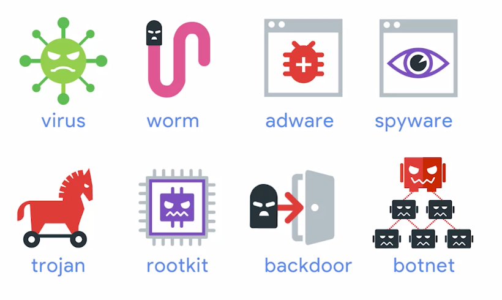

- **Virus**: Funcionan igual que los virus del cuerpo humano, infectan archivos "sanos" y se replican a si mismos.

- **Worms** (gusanos): Son comos los virus, pero no infectan a archivos sanos, si no que son archivos ejecutables completos (procesos) y no necesitan "inyectar" su código en otros archivos ejecutables. Pueden replicarse por el sistema y la red y aparecer en múltiples ubicaciones. 🐛[ILOVEYOU fue un gusano famoso](https://es.wikipedia.org/wiki/ILoveYou).

- **Adware**: Software que muestra anuncios y publicidad sin que te hayas dado cuenta que se instalaron, por no leer😤.

- **Troyanos**: Es el mismo concepto que el caballo de Troya. Es un malware que se disfraza de una cosa pero hace otra, como un activador de Office o un Keygen.

- **Spyware**: Es un malware que tiene como intención espiarte. Recopilar información, contraseñas, grabar la pantalla, mirar por la cámara, micrófono, lo que necesite.

- **Keylogger**: Es un spyware que se centra en grabar todas las pulsaciones de teclado y enviarlas. Se suele hacer para capturar contraseñas, pero también conversaciones, mensajes, etc.

- **Ransomware**: Es un software que toma tus datos como rehén, encriptando su acceso, a cambio de dinero.

- **Botnets**: Están diseñados para aprovecharse de las máquinas conectadas a internet para realizar alguna función distribuida. Es como si miles de equipos infectados se convirtieran en zombies y, usando tus recursos como la CPU, realizaran alguna tarea sin tu consentimiento. Por ejemplo, minería de bitcoins, o algún tipo de ataque organizado.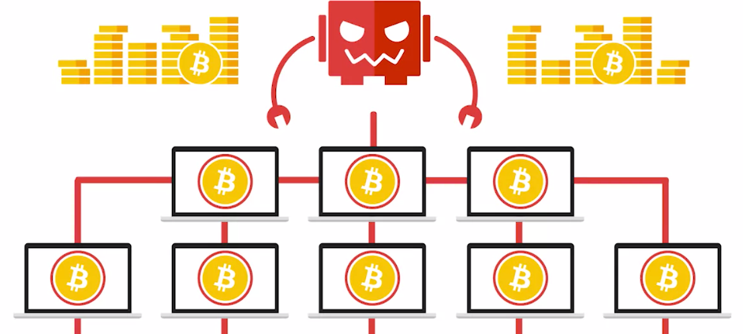

- **Backdoor** (puerta trasera): Es una forma de entrar al sistema por otros medios no convencionales. Es una puerta secreta. Normalmente esas puertas las instalan los atacantes después de acceder al sistema, y así mantienen el acceso para poder entrar más veces. Es posible que te des cuenta que han entrado, pero no descubras esa puerta secreta, por lo que pueden volver a entrar una y otra vez hasta que descubras por donde entran.

- **Bomba Lógica:** Es tipo de malware que se instala intencionalmente para que cuando transcurra un evento o un cierto tiempo, se ejecute. Hay un caso popular de bomba lógica que sucedió en 2006, en el que un disgustado administrador de sistemas de un banco hizo estallar una bomba lógica que hizo caer los servicios de la empresa en un intento de bajar el precio de sus acciones. El ex empleado fue capturado, acusado de fraude, y luego condenado a 8 años de prisión. Poca broma.

- **Rootkit**: Es una de las más peligrosas, porque pueden hacer de todo. Es un software que permite acceder como administrador al que lo usa, pudiendo obtener o modificar los permisos del sistema tal cual lo haría un administrador. Puede ser difícil de detectar porque puede ocultarse del sistema usando el propio sistema.

  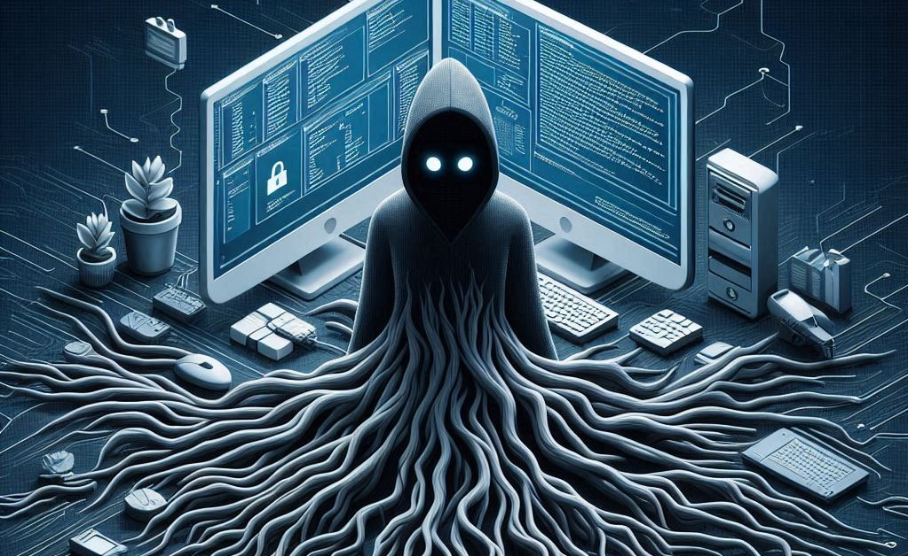

## Cómo Protegerse del Malware

- **Instalar y actualizar software Antivirus**: Mantener actualizado el software de seguridad.
- **No descargar archivos de fuentes no confiables**: Evitar descargar programas y archivos de sitios web dudosos. Siempre usar sus canales y tiendas oficiales.
- **Mantener el sistema operativo y aplicaciones actualizadas**: Aplicar las actualizaciones de seguridad regularmente.
- **Sentido común:** Lee, lee y vuelve a leer. En la instalación no le des a siguiente, siguiente y siguiente. En una aplicación móvil mira las descargas que tiene, mira los comentarios, mira los permisos, etc. Ten cuidado con lo que instalas y de dónde lo instalas. Desconfía de todo, otra vez.

# 🛡️Herramientas de protección comunes

La protección contra amenazas cibernéticas requiere el uso de diversas herramientas de seguridad que actúan como barreras y mecanismos de detección ante posibles ataques. Estas herramientas son esenciales para mantener nuestros dispositivos y datos seguros frente a malware, intrusiones y otras formas de ciberataques. A continuación, exploraremos algunas de las herramientas más comunes y efectivas disponibles, tanto integradas en el sistema operativo Windows como ofrecidas por proveedores externos.

> [!IMPORTANT]
>
> Las herramientas de protección son indispensables para asegurar nuestros dispositivos y datos en el entorno digital actual. Ya sea utilizando las soluciones integradas en Windows o complementándolas con software de terceros, mantener una buena higiene de seguridad y estar al tanto de las últimas amenazas es fundamental. Seleccionar y configurar adecuadamente estas herramientas puede significar la diferencia entre una red segura y una vulnerable a ataques cibernéticos.

## Herramientas de Protección en Windows

Windows proporciona varias herramientas de seguridad que están integradas en el sistema operativo, ofreciendo una línea de defensa robusta y fácil de usar.

1. **Windows Defender Antivirus**
   - **Descripción**: Es un software de protección contra malware que viene preinstalado en todas las versiones modernas de Windows. Ofrece protección en tiempo real contra virus, spyware y otro software malicioso.
   - **Características**:
     - Escaneos automáticos y manuales
     - Actualizaciones frecuentes de definiciones de virus
     - Protección en tiempo real
2. **Windows Firewall**
   - **Descripción**: Es una herramienta que filtra el tráfico de red y bloquea las conexiones no autorizadas al ordenador.
   - **Características:**
     - Bloqueo de programas no deseados
     - Configuración de reglas de tráfico entrante y saliente
     - Protección de la red
3. **Windows Security (Centro de Seguridad de Windows)**
   - **Descripción**: Un centro unificado para gestionar la seguridad del dispositivo, que incluye antivirus, firewall y protección de cuentas.
   - **Características:**
     - Panel de control centralizado
     - Supervisión de seguridad y salud del dispositivo
     - Herramientas de protección de identidad y cuentas

> [!NOTE]
>
> En Windows 11, todo lo descrito anteriormente está centralizado en la aplicación Seguridad de Windows ➡️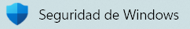

## Soluciones de Terceros

Además de las herramientas integradas en Windows, **existen muchas soluciones de terceros** que pueden ofrecer niveles adicionales de protección y funcionalidades avanzadas. Suelen tener versiones gratuitas con opción a mejoras de pago por suscripción.

1. **[McAfee](https://www.mcafee.com/es-es/index.html)**

   - **Descripción**: Una solución de seguridad completa que incluye antivirus, firewall, protección web y herramientas de privacidad.
   - **Características:**
     - Protección contra malware en tiempo real
     - Gestión de contraseñas
     - Protección contra phishing

2. **[Avast](https://www.avast.com/es-es/)**

   - **Descripción**: Un software antivirus gratuito y de pago conocido por su eficacia y amplia gama de características.
   - **Características:**
     - Protección contra virus y malware
     - Escudos de comportamiento y análisis de red
     - Herramientas de optimización del sistema

3. **[Norton](https://es.norton.com/)**

   - **Descripción**: Proporciona protección antivirus, firewall, y funciones avanzadas como la protección contra ransomware y la supervisión de la dark web.
   - **Características:**
     - Protección en tiempo real
     - Copias de seguridad en la nube
     - Seguridad para múltiples dispositivos

4. **[Bitdefender](https://www.bitdefender.es/)**

   - **Descripción**: Ofrece una combinación de antivirus, antimalware y herramientas de seguridad adicionales.
   - **Características:**
     - Protección avanzada contra amenazas
     - Módulos de protección de datos y privacidad
     - Herramientas de rendimiento y optimización

   

> [!WARNING]
>
> 🐛🪱🦠🛡️No instales más de un software antivirus en el mismo equipo simultáneamente. Esto puede afectar seriamente el rendimiento y causar interferencias entre ellos. Elige uno y mantén solo ese y sobre todo, el sentido común.
