# Índice

[TOC]

------

# Certificados Digitales

## Introducción

**Un certificado digital es un documento electrónico que permite la identificación segura de personas y entidades en internet**. Funciona de manera similar a un documento de identidad en el mundo físico, garantizando la autenticidad de la información transmitida en el entorno digital. Los certificados digitales son emitidos por autoridades certificadoras (CA) reconocidas, que verifican la identidad del solicitante antes de expedir el certificado.

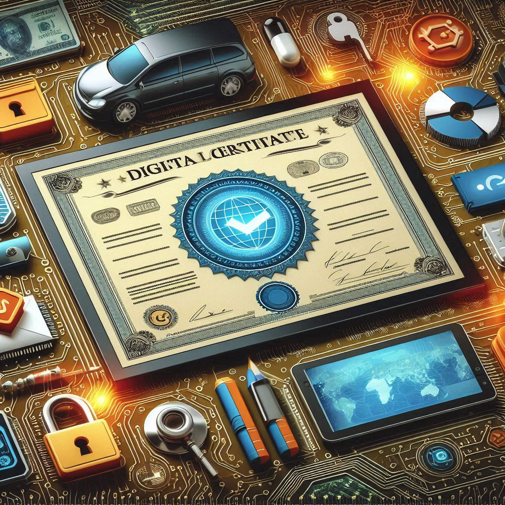
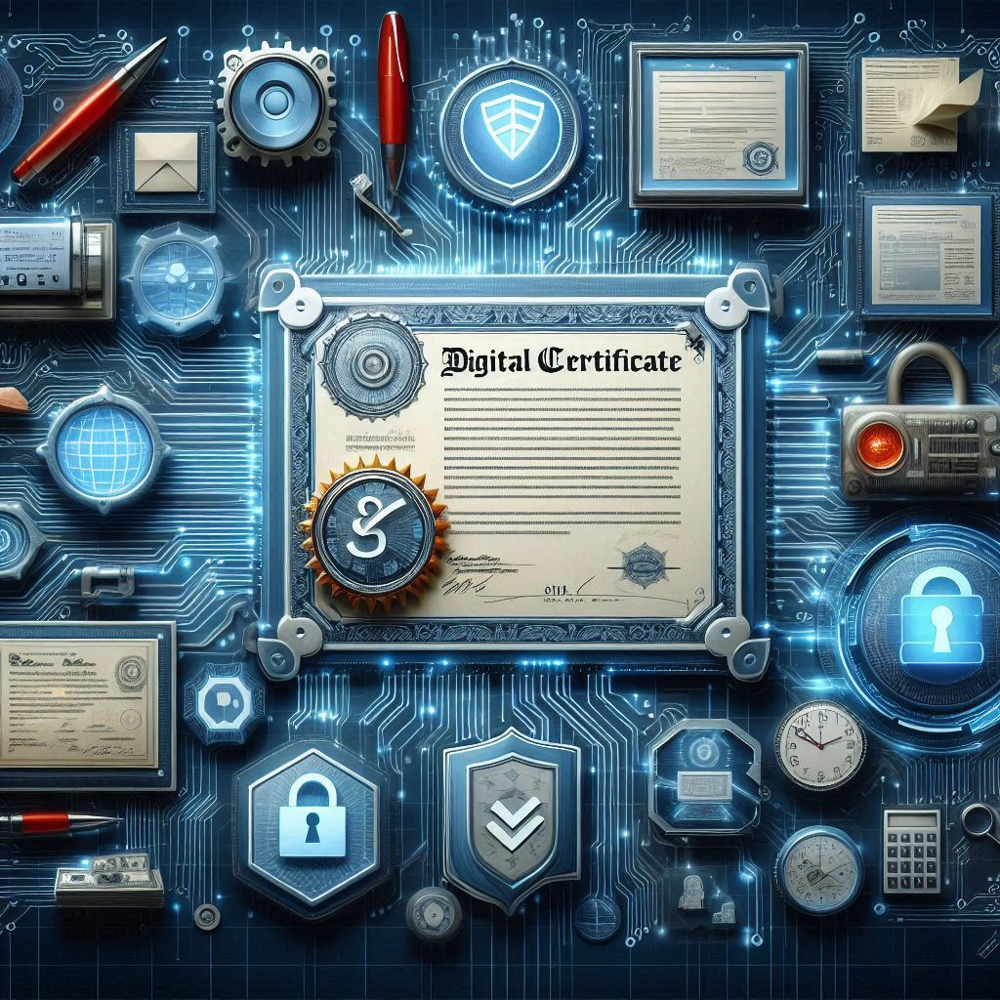

## ¿Qué es un Certificado Digital?

Un certificado digital contiene una serie de datos que identifican al titular, como su nombre, dirección de correo electrónico y una clave pública. Esta información está firmada digitalmente por una autoridad certificadora, lo que garantiza su validez y autenticidad. Los certificados digitales se utilizan para cifrar y firmar digitalmente documentos y comunicaciones, asegurando su integridad y confidencialidad.

> [!TIP]
>
> Una autoridad certificadora (CA) es una entidad de confianza que emite y gestiona certificados digitales, verificando la identidad de los solicitantes para garantizar la autenticidad y seguridad de las comunicaciones electrónicas. En España, la principal autoridad certificadora que emite certificados digitales es la Fábrica Nacional de Moneda y Timbre (FNMT), que ofrece certificados para personas físicas, representantes de empresas y otras entidades.

## Usos y ventajas de los certificados digitales

**Usos:**

Esta tabla presenta algunos de los servicios públicos más utilizados en España y Andalucía, con una breve descripción y enlaces directos a los sitios oficiales donde se pueden realizar los trámites con el certificado digital.

| Servicio                                                     | Descripción                                                  | Enlace                                                       |
| ------------------------------------------------------------ | ------------------------------------------------------------ | ------------------------------------------------------------ |
| **Agencia Tributaria**                                       | Permite realizar trámites fiscales como la declaración de la renta, consultar y pagar impuestos. | [Agencia Tributaria](https://www.agenciatributaria.gob.es/)  |
| **Clic Salud (Andalucía)**                                   | Accede a tu historia clínica, pide citas y consulta resultados de pruebas médicas. | [Clic Salud](https://www.juntadeandalucia.es/servicioandaluzdesalud/clicsalud/) |
| **Seguridad Social**                                         | Accede a informes de vida laboral, solicita prestaciones y consulta cotizaciones. | [Seguridad Social](https://sede.seg-social.gob.es/)          |
| **Vida Laboral**                                             | Consulta y descarga tu informe de vida laboral, que detalla tus cotizaciones y períodos de empleo. | [Vida laboral](https://portal.seg-social.gob.es/wps/portal/importass/importass/Categorias/Vida+laboral+e+informes/Informes+sobre+tu+situacion+laboral/Informe+de+tu+vida+laboral) |
| **Consejería de Hacienda y Financiación Europea (Andalucía)** | Realiza trámites fiscales y consulta información tributaria regional. | [Consejería de Hacienda](https://www.juntadeandalucia.es/organismos/haciendayfinanciacioneuropea.html) |
| **DGT (Dirección General de Tráfico)**                       | Gestiona trámites relacionados con vehículos y conductores, como multas y renovaciones de permisos. | [DGT](https://sede.dgt.gob.es/)                              |
| **Ministerio de Justicia**                                   | Solicita certificados de antecedentes penales y gestiona trámites de nacionalidad y registro civil. | [Ministerio de Justicia](https://sede.mjusticia.gob.es/)     |
| **Catastro**                                                 | Consulta datos catastrales y realiza gestiones sobre propiedades inmobiliarias. | [Catastro](https://www.sedecatastro.gob.es/)                 |
| **SEPE (Servicio Público de Empleo Estatal)**                | Realiza gestiones relacionadas con prestaciones por desempleo y formación laboral. | [SEPE](https://sede.sepe.gob.es/)                            |
| **SAE (Servicio Andaluz de Empleo)**                         | Gestiona demandas de empleo, formación y prestaciones en Andalucía. | [SAE](https://www.juntadeandalucia.es/organismos/sae.html)   |
| **CATA (Certificados Académicos y Títulos Andalucía)**       | Solicita y consulta certificados académicos y títulos oficiales en Andalucía. | [CATA](https://www.juntadeandalucia.es/educacion/portals/web/ced) |

> [!IMPORTANT]
>
> Más adelante veremos una aplicación para móviles donde podremos consultar de forma centralizada la mayoría de recursos arriba indicados. Sin necesidad de ir de una página a otra y todo desde tu móvil.

**Ventajas:**

1. **Seguridad:** Garantiza la confidencialidad, integridad y autenticidad de la información transmitida.
2. **Eficiencia:** Simplifica y agiliza procesos administrativos y transacciones en línea, reduciendo la necesidad de documentación física.
3. **Confianza:** Aumenta la confianza en las transacciones digitales al asegurar que las partes involucradas son quienes dicen ser.
4. **Legalidad:** Las firmas digitales realizadas con certificados digitales tienen validez legal, cumpliendo con las normativas vigentes.

# Solicitar un certificado digital de ciudadano

En España, los certificados digitales son emitidos por diferentes Autoridades de Certificación (CA) como la Fábrica Nacional de Moneda y Timbre (FNMT), Camerfirma y otras. A continuación, se detalla el proceso para obtener un **certificado digital para un ciudadano** a través de la FNMT.

- **Acceder al Sitio Web de la FNMT:**

   - Visita la página oficial de la [FNMT](https://www.sede.fnmt.gob.es/certificados) y selecciona el tipo de certificado que necesitas (persona física, representante, etc.). En nuestro caso elegiremos el certificado para ciudadano o persona física.

     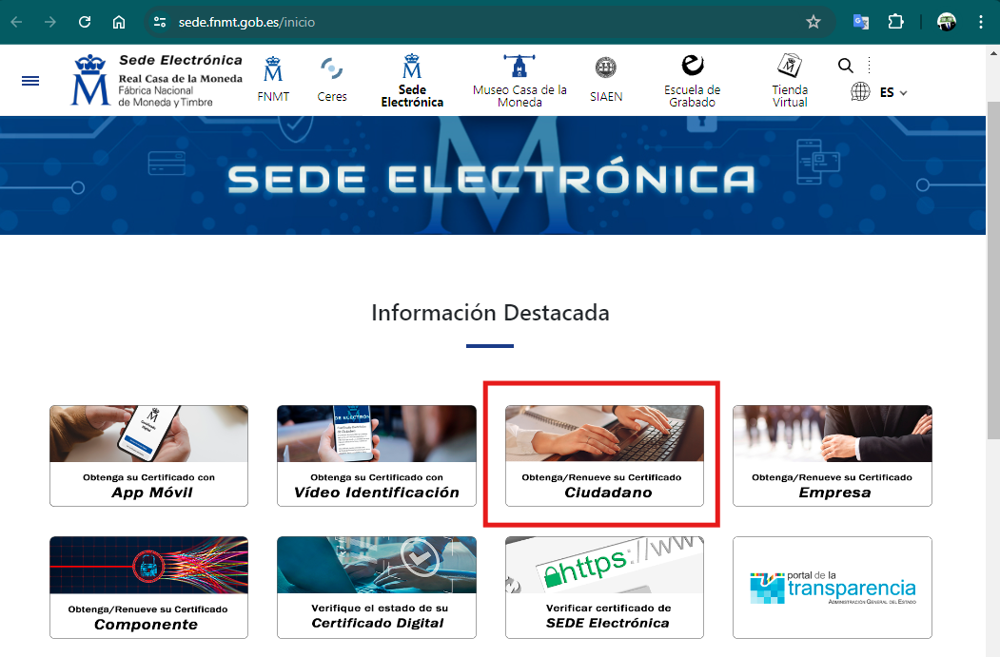

- **Solicitar el Certificado:** Existen 4 formas distintas para obtener el Certificado electrónico de Ciudadano, nosotros nos centraremos en la [acreditación presencial en una oficina](https://www.sede.fnmt.gob.es/certificados/persona-fisica/obtener-certificado-software). Para esta forma, hay que seguir los siguientes pasos:

   1. **[Configuración previa](https://www.sede.fnmt.gob.es/certificados/persona-fisica/obtener-certificado-software/configuracion-previa).** Para solicitar el certificado es necesario descargar e instalar el software siguiente:

      1. [Configurador FNMT](https://www.sede.fnmt.gob.es/descargas/descarga-software/instalacion-software-generacion-de-claves). Solo es pulsar <kbd>Siguiente</kbd> hasta <kbd>Finalizar</kbd>.

         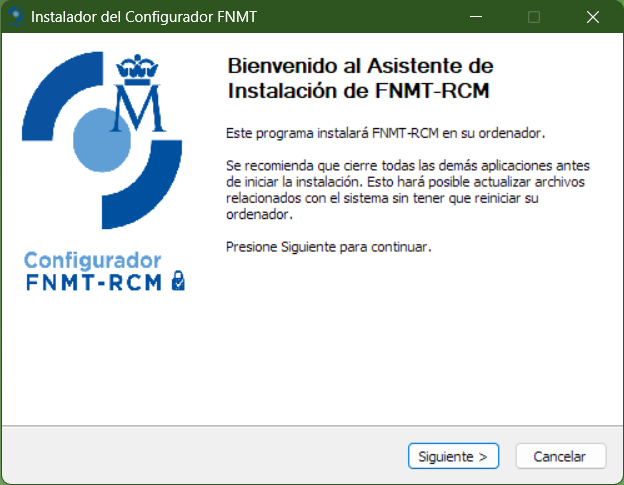

      2. **Autofirma64**: Lo puedes [descargar desde aquí](https://firmaelectronica.gob.es/Home/Descargas.html). <kbd>Siguiente</kbd> y dejar todas las opciones por defecto.

         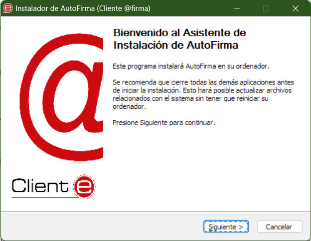

      

      

   2. **[Solicitud vía internet de su Certificado](https://www.sede.fnmt.gob.es/certificados/persona-fisica/obtener-certificado-software/solicitar-certificado).** Una vez instalado el software anterior, habrá que rellenar este formulario para realizar la solicitud del certificado. 

      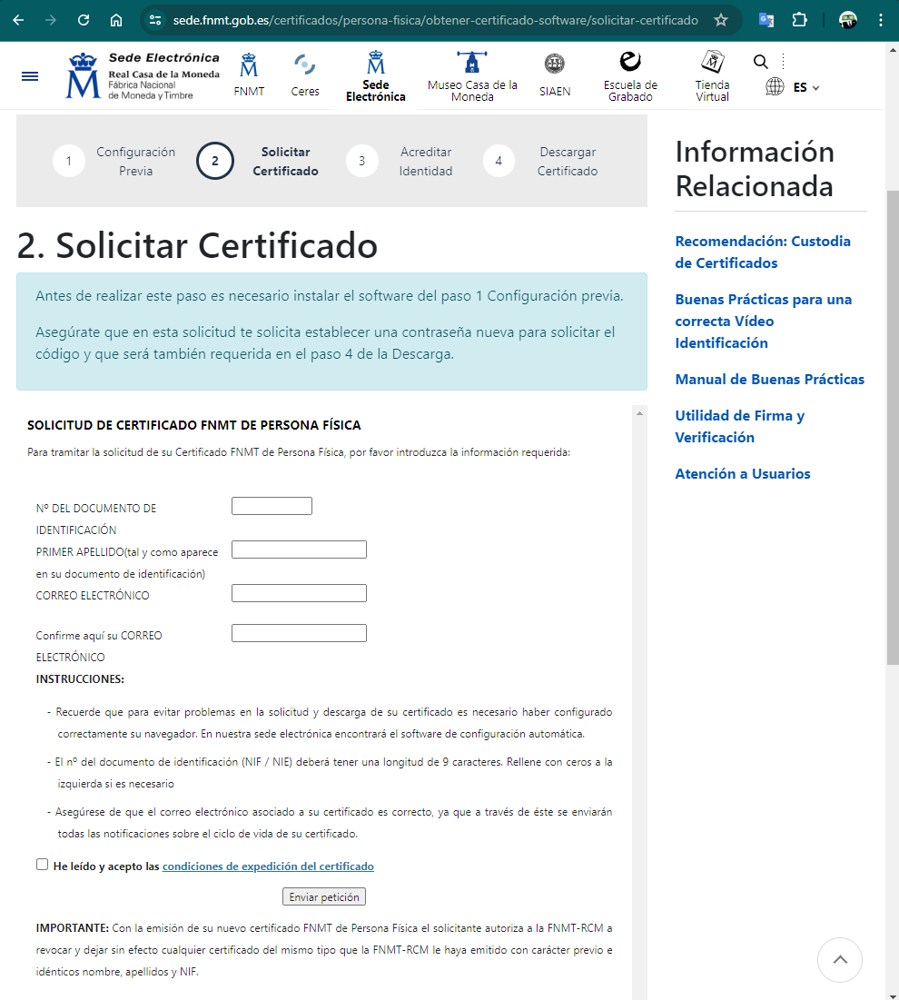

      Al finalizar el proceso de solicitud, usted recibirá en su cuenta de correo electrónico un Código de Solicitud que le será requerido en el momento de acreditar su identidad (siguiente paso) y posteriormente a la hora de descargar su certificado (último paso).

   3. [Acreditación presencial en una Oficina de Acreditación de Identidad](https://www.sede.fnmt.gob.es/certificados/persona-fisica/obtener-certificado-software/acreditar-identidad). Una vez completada la fase anterior y **esté en posesión de su Código de Solicitud**, para continuar con el proceso deberá Acreditar su Identidad en una de nuestras Oficinas de Acreditación de Identidad.

      Para su comodidad, puede usted hacer uso de nuestro servicio [LOCALIZADOR DE OFICINAS](http://mapaoficinascert.appspot.com/).

      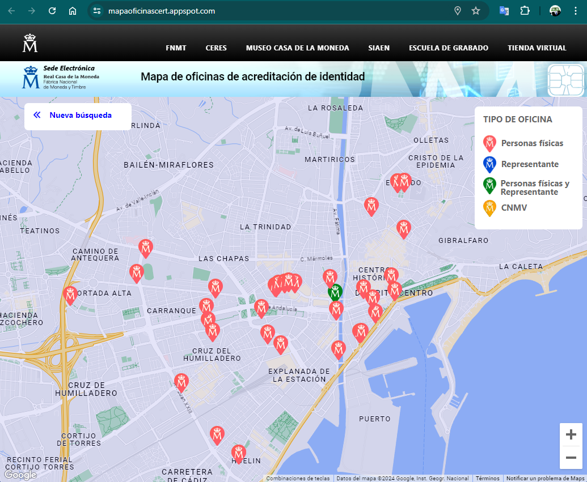

      > [!IMPORTANT] 
      >
      > En las oficinas de la AEAT, Seguridad Social y en otras oficinas se requiere de cita previa, [consulte con la propia oficina aquí.](http://www.seg-social.es/wps/portal/wss/internet/OficinaSeguridadSocial/)
      >
      > 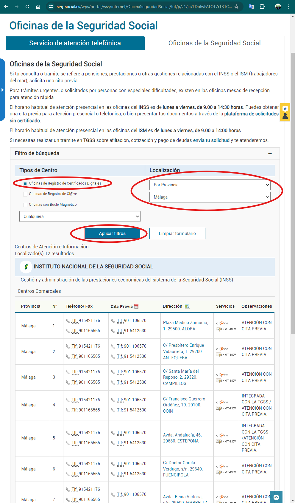

   4. **[Descarga de su Certificado de Usuario](https://www.sede.fnmt.gob.es/certificados/persona-fisica/obtener-certificado-software/descargar-certificado).** Aproximadamente 1 hora después de que haya acreditado su identidad en una Oficina de Acreditación de Identidad y haciendo uso de su Código de Solicitud, desde aquí podrá descargar e instalar su certificado y realizar una copia de seguridad.

      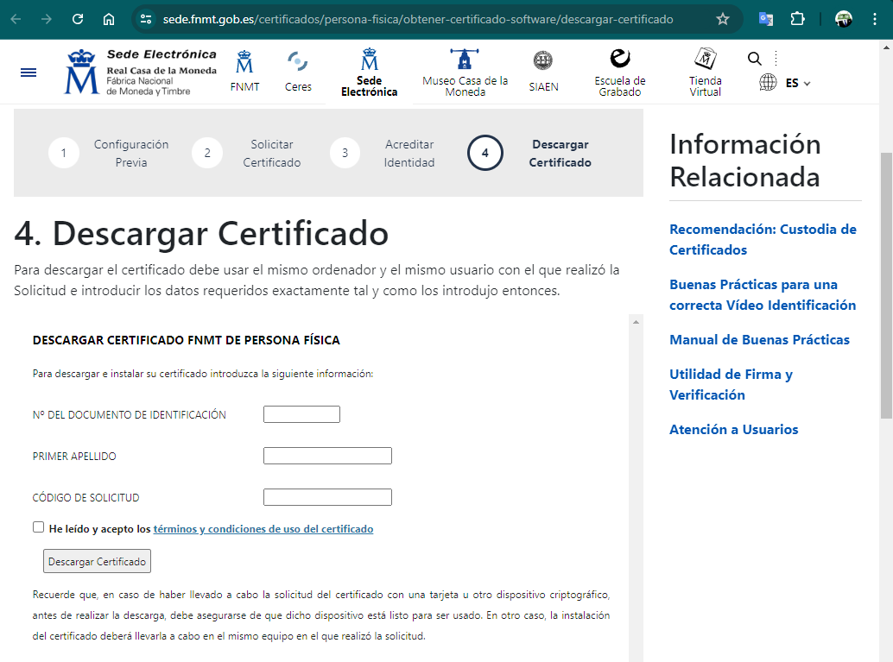

   5. **Copia de seguridad:** Al descargarse también nos preguntará si queremos descargar una copia de seguridad. Esto es muy útil debido a que si formateamos el ordenador o bien queremos instalar el certificado en otro dispositivo (otro pc, un móvil, una tablet) necesitaremos una copia de seguridad. La descargaremos como un archivo normal que tiene extensión `.pfx` o `.p12` y la guardamos en un sitio seguro. Nos preguntará también una contraseña para cifrar el certificado. **Importantísimo guardarla y no olvidarla ya que sin esta contraseña no podremos instalar el certificado en ningún sitio.**

   6. En éste proceso, se instalará el certificado en nuestro ordenador, por lo que no es necesario instalarlo manualmente.
   
      

> [!TIP]
>
> 🚨**IMPORTANTE**🚨
>
> Una vez descargado el certificado digital verás que es un archivo normal y corriente como cualquier otro en tu pc. Se recomienda encarecidamente que lo guardes en un sitio seguro donde podrás encontrarlo en un futuro (una ubicación concreta de tu pc, un pendrive, etc.). Piensa que ese archivo es tu DNI en internet, y si lo pierdes tendrías lo mismos riesgos o incluso más que si perdieras tu DNI físico.
>
> 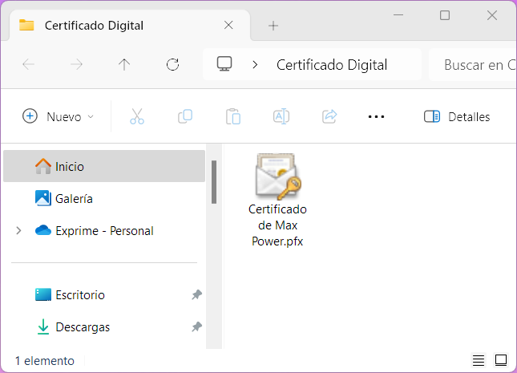

# Instalar el certificado descargado en Windows

> [!NOTE]
>
> En el proceso de descarga, ya se instala el certificado de forma automática. Los pasos descritos a continuación solo son necesarios si se quiere instalar en otro usuario, en otro ordenador, o bien después de haber formateado el ordenador.

Una vez que lo tenemos descargado y guardado a buen recaudo, procederemos a instalarlo. Para ello hacemos doble clic sobre el archivo del certificado y nos aparecerá una ventana como la siguiente:

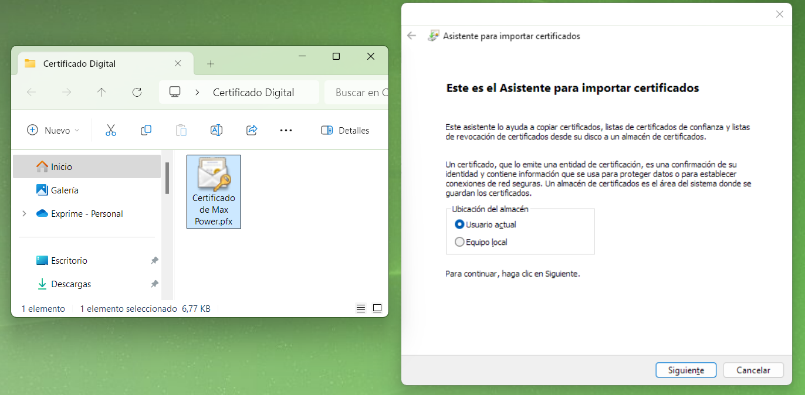

1. **Ubicación:** Nos preguntará si queremos instalarlo para el usuario actual que tiene la sesión iniciada, o para todos los usuarios del equipo. Por seguridad se recomienda instalarlo en nuestro usuario actual y pulsamos <kbd>Siguiente</kbd>.

   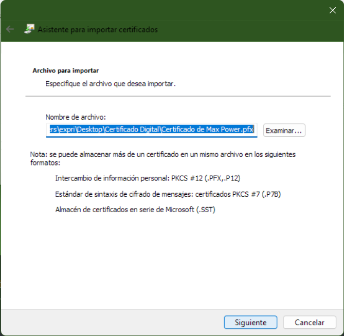

2. **Información:** En esta pantalla solo nos muestra información, pulsamos <kbd>Siguiente</kbd>.

   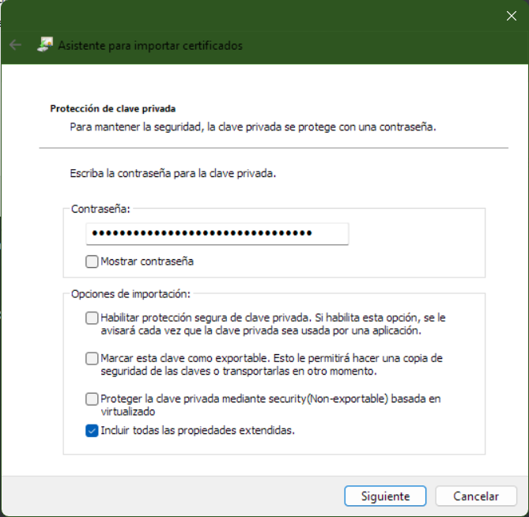

3. **Contraseña:** Aquí deberemos introducir la contraseña que pusimos cuando creamos la copia de seguridad al descargarlo. Además hay varias opciones:

   - ❎**Habilitar protección:** Si marcamos esta casilla, nos pedirá la contraseña cada que usemos el certificado digital. Nosotros no vamos a seleccionarlo, pero si quieres más seguridad, puedes marcarla.
   - ❎**Marcar esta clave como exportable.**: Quiere decir que sin tener el archivo físico del certificado, se podrá exportar a un nuevo archivo desde este pc. Si tienes a buen recaudo (como te aconsejamos) el certificado, es aconsejable no marcar esta opción, ya que cualquiera que use nuestro pc, podría hacerse con una copia del certificado.
   - ❎**Proteger la clave privada:** Esta no la marcaremos. No es necesaria.
   - ☑️**Incluir todas las propiedades extendidas**: Esta casilla la dejamos marcada para que se instale el certificado raíz de la FMNT, para que Windows pueda usar el certificado en distintas aplicaciones.
   - Una vez puesta la contraseña y las opciones, pulsamos <kbd>Siguiente</kbd>.

   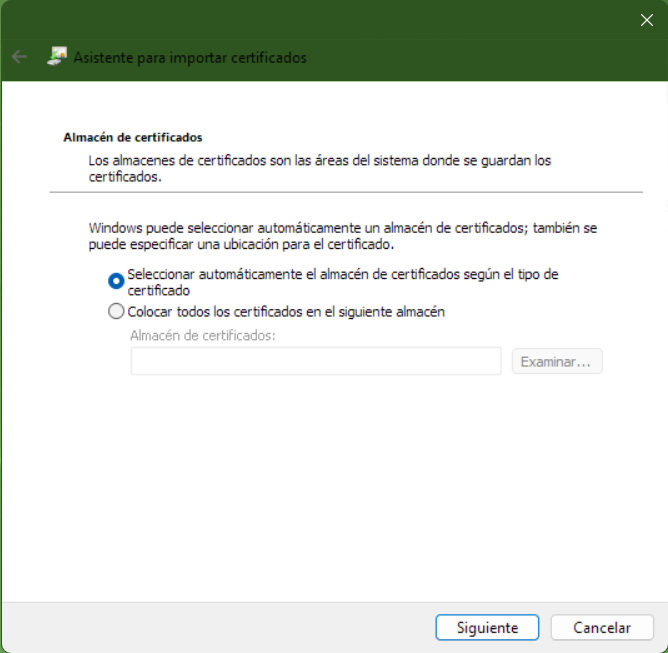

   

4. **Almacén de certificados:** Dejamos la opción que sale marcada por defecto y pulsamos <kbd>Siguiente</kbd>.

   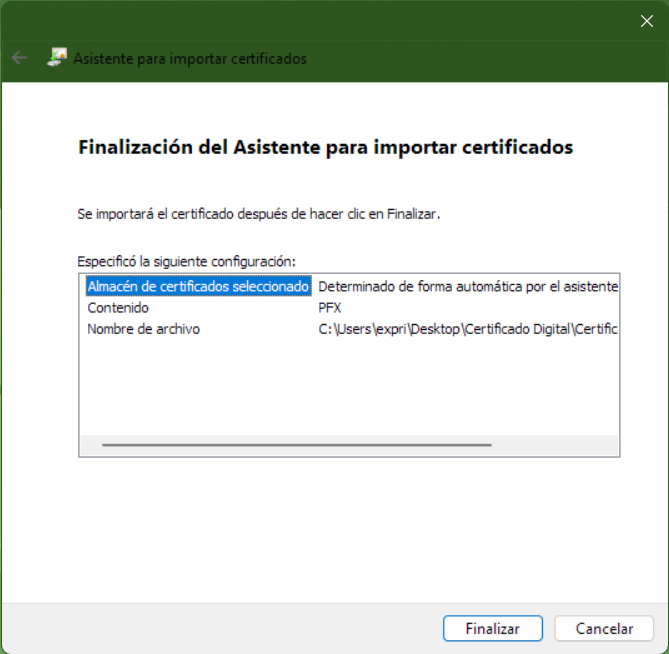

5. **Finalización:** Nos muestra un resumen y ya tenemos nuestro certificado instalado. Ya podemos hacer clic en <kbd>Finalizar</kbd>.

   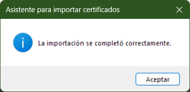

## Comprobación

Si queremos comprobar si el certificado está instalado correctamente, podemos verificar su estado siguiendo los siguientes pasos:

1. Vamos a https://www.sede.fnmt.gob.es/certificados/persona-fisica/verificar-estado.

   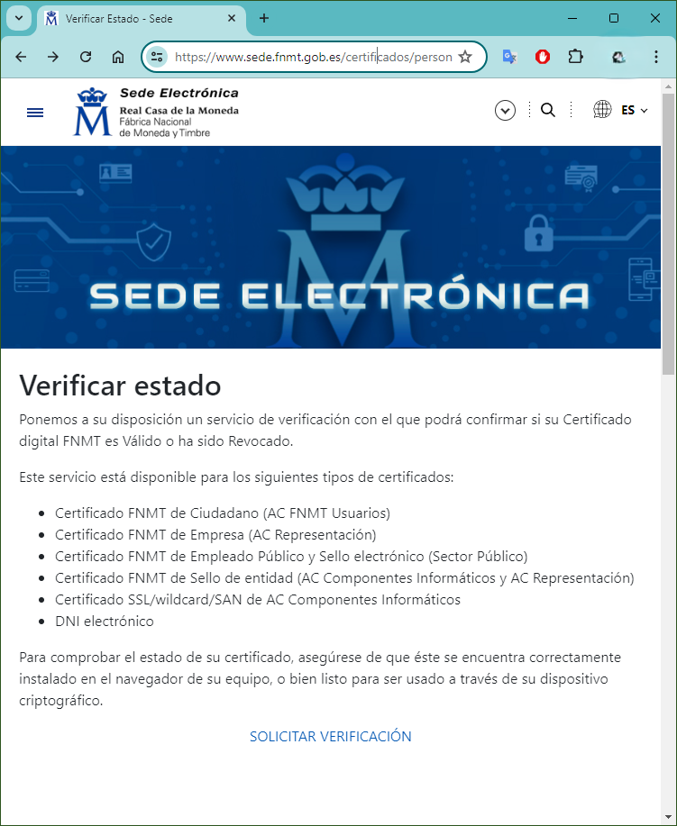

2. Ahí pulsamos en <kbd>SOLICITAR VERIFICACIÓN</kbd> y nos aparecerá una ventana emergente como la siguiente:

   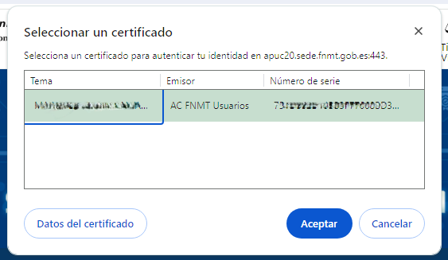

3. Hacemos clic en nuestro certificado, pulsamos <kbd>Aceptar</kbd>.

   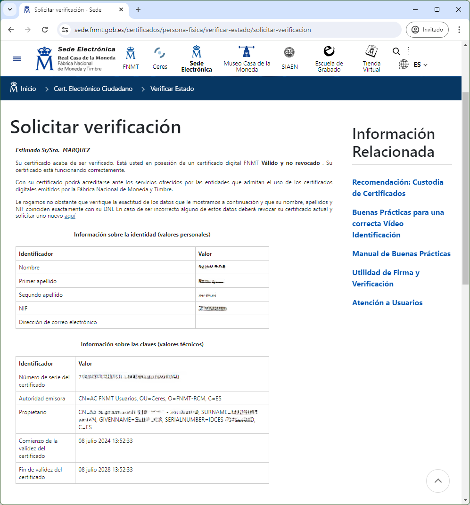

7. Y ahí podremos ver los datos de nuestro certificado, así como las fechas de validez.

---

Vamos a ver también como usarlo en otro servicio, por ejemplo Clic Salud.

1. Vamos a Clic Salud en https://www.juntadeandalucia.es/servicioandaluzdesalud/clicsalud/.

   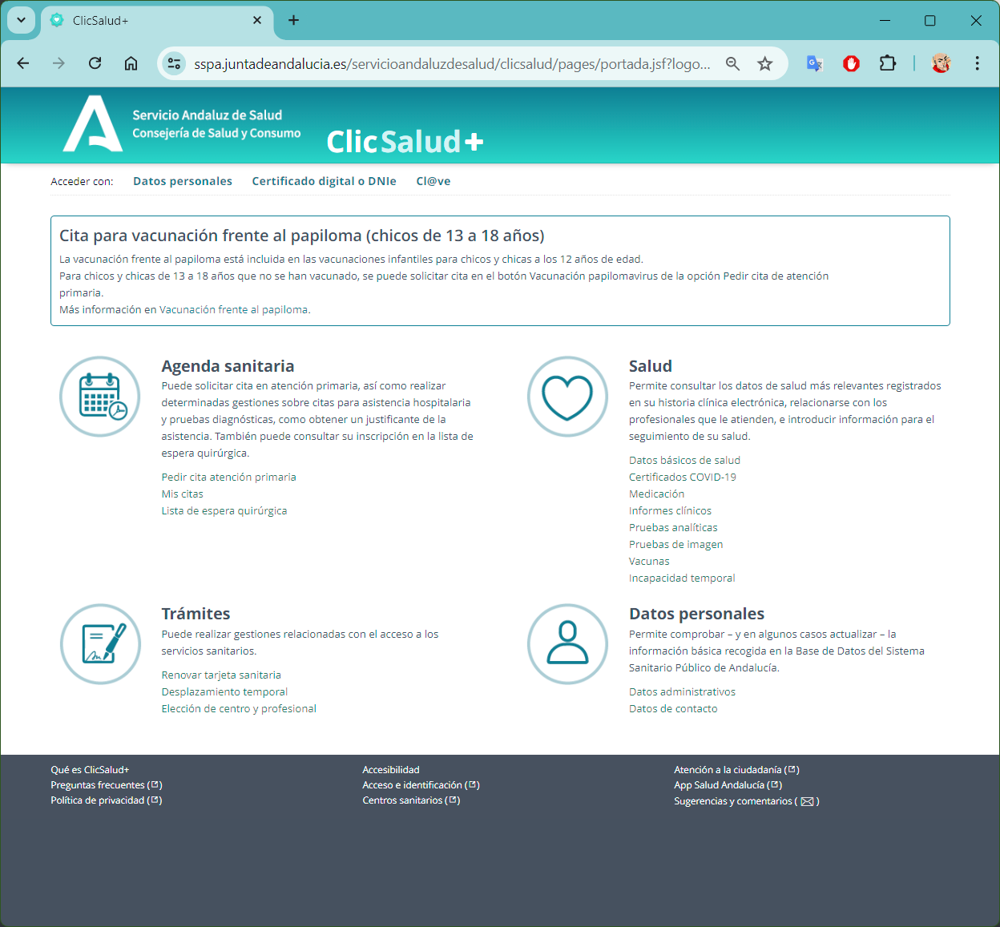

2. Pulsamos en <kbd>Acceder con: Certificado Digital</kbd>, arriba del todo. Se abrirá una pequeña ventana con los certificados que tengamos instalados en el sistema operativo. Deberá de existir uno con tu nombre y apellidos.

   

3. Al seleccionar nuestro certificado, accedemos a la página con accesos a nuestra información médica como medicación, informes clínicos, pruebas analíticas, etc. También podemos realizar trámites como renovar tarjeta sanitaria, pedir cita médica, etc. Todo sin usuarios ni contraseñas.

   

   

# Instalar el certificado descargado en Android

1. **Obtener el Certificado Digital:** El primer paso es obtenerlo desde un PC con los pasos descritos anteriormente en [Solicitar un certificado digital de ciudadano](#Solicitar un certificado digital de ciudadano). El certificado estará en un archivo con extensión `.pfx` o `.p12`. Asegúrate de recordar la contraseña que estableciste al exportar o descargar el certificado.
2. **Transferir el Certificado al Móvil:**
   - Conecta tu móvil Android a la computadora mediante un cable USB, y copia el archivo del certificado digital al almacenamiento interno del móvil, en una ubicación fácil de encontrar (por ejemplo, la carpeta de Descargas).
   - También puedes copiarlo en algún almacenamiento en la nube que puedas acceder fácilmente desde el móvil desde la app correspondiente, así no tendrás que enchufarlo. Por ejemplo OneDrive, Google Drive, etc.
   - Otra opción rudimentaria es enviarlo por email como archivo adjunto a algún email que puedas abrir desde el móvil. Después lo descargas y lo abres directamente.
3. **Instalar el Certificado en el Móvil:**
   - Normalmente, podrás abrir directamente el archivo que copiaste en el paso 2 e instalarlo. Solo te pedirá el nombre con el que quieres guardarlo para poder identificarlo y la contraseña que usaste para descargarlo.  Si no puedes hacer esto, sigue los siguientes pasos. 
   - Abre la aplicación **"Ajustes"** en tu móvil Android.
   - Ve a **"Seguridad"** (puede variar según la versión y la capa de personalización del fabricante; en algunas versiones puede estar en **"Biometría y seguridad"** o **"Pantalla de bloqueo y seguridad"**).
   - Selecciona **"Instalar desde almacenamiento"** o **"Instalar certificados"** (esta opción también puede variar ligeramente).
4. **Seleccionar el Certificado:**
   - Navega hasta la ubicación donde guardaste el archivo del certificado digital.
   - Selecciona el archivo `.pfx` o `.p12`.
5. **Introducir la Contraseña:**
   - Introduce la contraseña que estableciste al exportar o descargar el certificado.
   - Asigna un nombre al certificado para identificarlo fácilmente más tarde.
6. **Finalizar la Instalación:**
   - Completa la instalación siguiendo las indicaciones en pantalla.
   - El certificado digital se instalará en el almacén de credenciales del móvil.
7. **Configurar el Uso del Certificado (opcional):**
   - Si planeas usar el certificado digital para aplicaciones específicas (como navegadores web, aplicaciones de correo electrónico, o servicios de la administración pública), abre la aplicación correspondiente y selecciona el certificado instalado cuando te lo solicite.

> [!IMPORTANT]
>
> Estos pasos deberían permitirte instalar un certificado digital en un dispositivo Android. Las opciones y terminología exactas pueden variar ligeramente dependiendo del fabricante del dispositivo y la versión de Android.

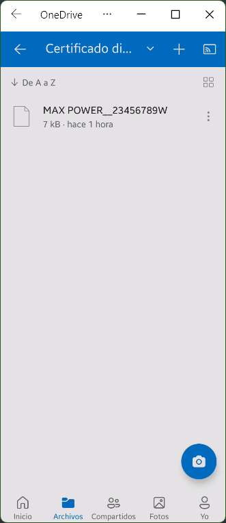
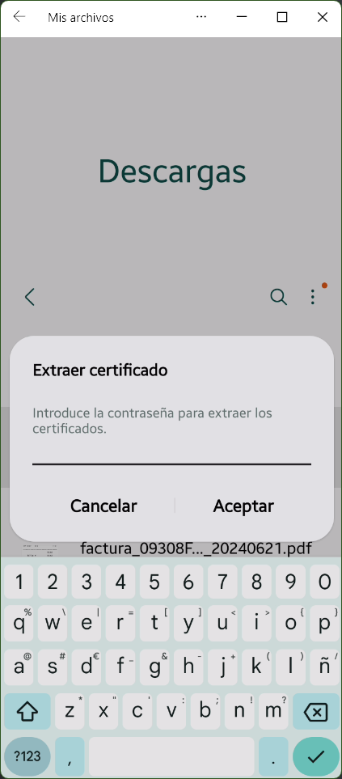
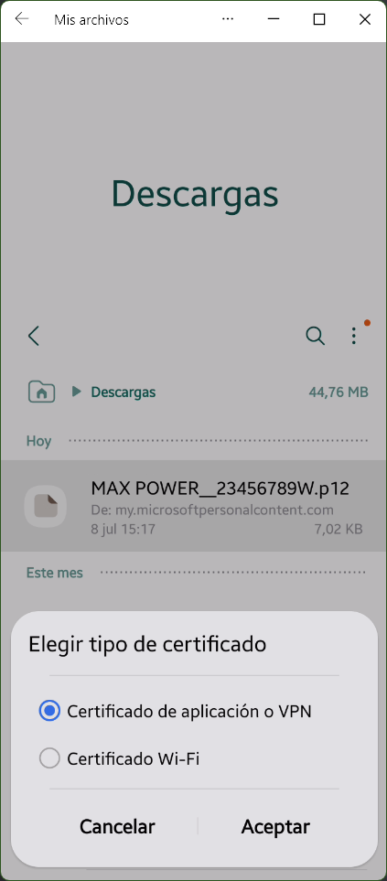
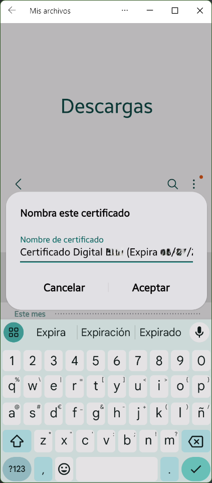
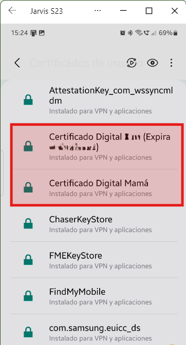

# Renovar un certificado digital

1. **Solicitar la Renovación:**
   
   - Accede a la página de renovación de certificados de la FNMT y selecciona el tipo de certificado que deseas renovar.
   
   - [Renovación de certificado para persona física](https://www.sede.fnmt.gob.es/certificados/persona-fisica/renovar)
   
     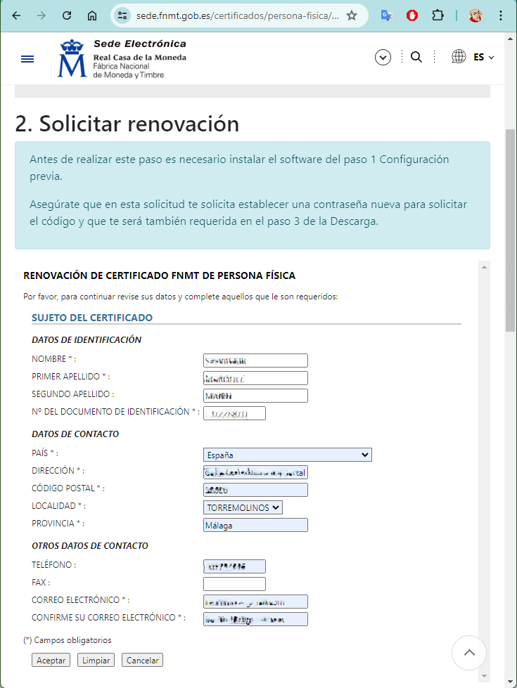
   
2. **Verificación de Identidad:**

   - En algunos casos, la renovación puede realizarse completamente en línea si tu identidad ya ha sido verificada previamente y tu certificado actual está aún vigente. Si tu certificado ha expirado, es posible que necesites volver a acreditar tu identidad en una oficina de registro.

3. **Generación de Nuevas Claves:**
   - Durante el proceso de renovación, puede ser necesario generar un nuevo par de claves (pública y privada) para asegurar la seguridad de tu certificado.

     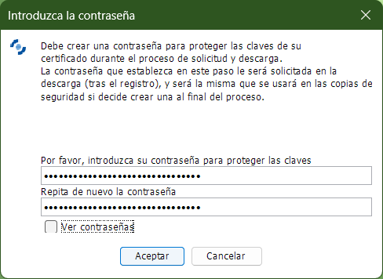

4. **Firmar:** Deberás confirmar los datos de la renovación firmando digitalmente (con autofirma). Recuerda que deberás tener instalado todo el software indicado en [Configuración Previa](https://www.sede.fnmt.gob.es/certificados/persona-fisica/renovar/configuracion-previa).

   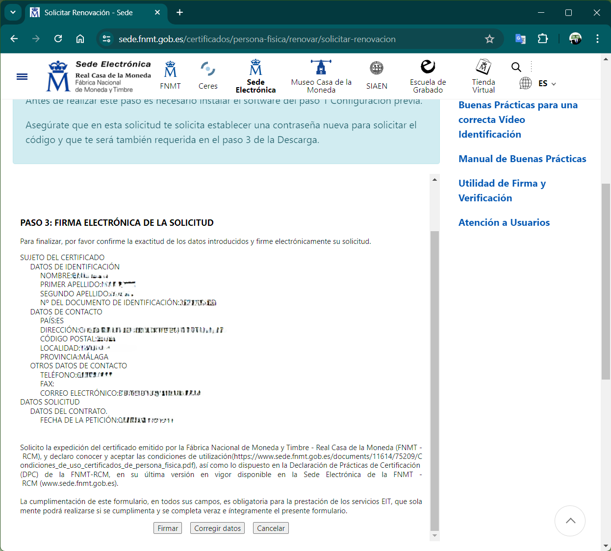

   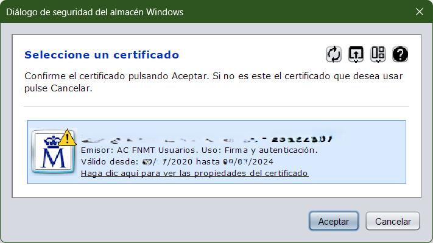

   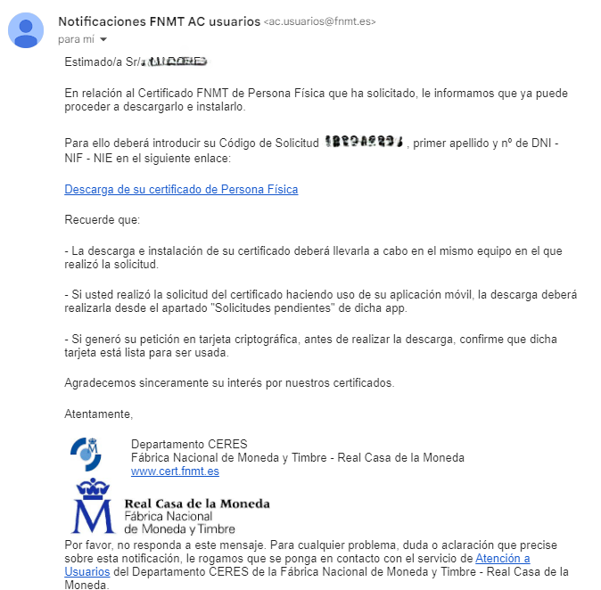

5. **Descargar el Nuevo Certificado:**

   - Una vez completada la solicitud de renovación y verificada la identidad (si es necesario), recibirás instrucciones para volver descargar e instalar el nuevo certificado digital (email anterior). Los pasos son los mismos descritos anteriormente.

     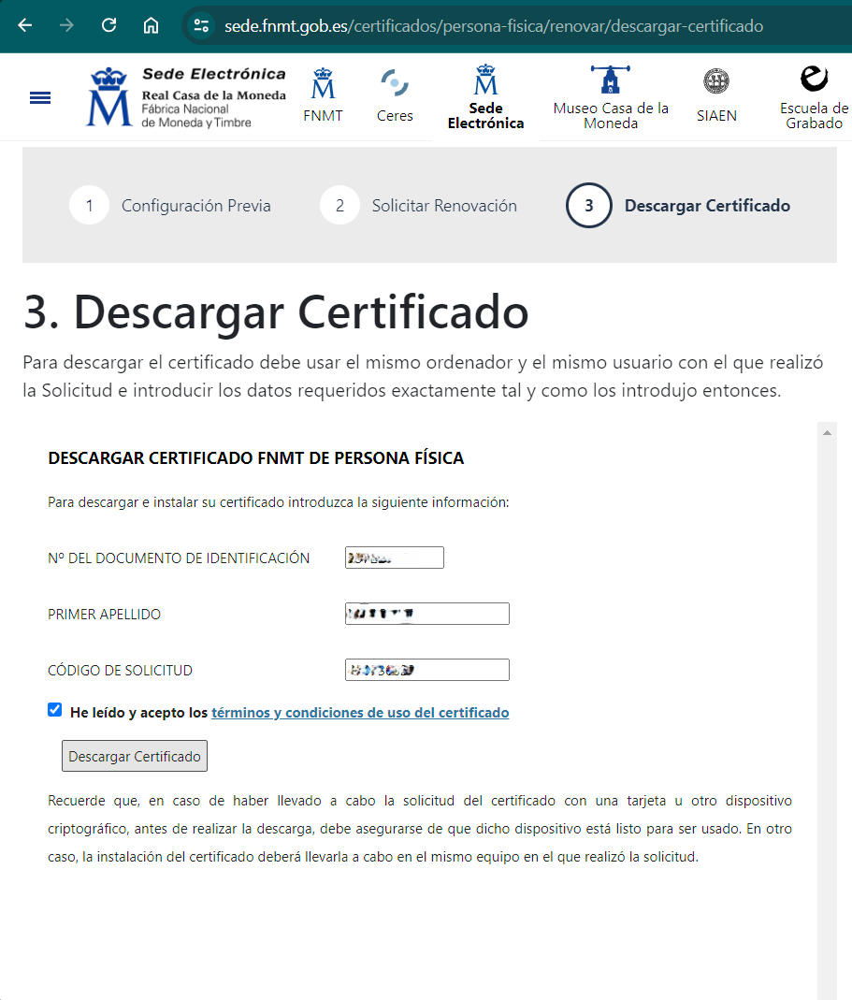

   

# Eliminar un certificado digital de Windows

Eliminar un certificado digital en Windows es un proceso sencillo que puede ser necesario cuando un certificado ha caducado, ya no es necesario, o se ha comprometido. A continuación se describen los pasos para eliminar un certificado digital utilizando el Administrador de certificados de Windows.

1. **Abrir el Administrador de Certificados**:

   - Presiona `Win + R` para abrir el cuadro de diálogo "Ejecutar".

   - Escribe `certmgr.msc` y presiona <kbd>Enter</kbd>.

     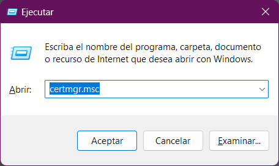

2. **Navegar a la Carpeta del Certificado**:

   - En el panel izquierdo, expande las carpetas para encontrar la categoría del certificado que deseas eliminar (por ejemplo, "Personal" o "Autoridades de certificación raíz de confianza"). Los certificados digitales que hemos tratado en el curso son de tipo **Personal**.

3. **Seleccionar el Certificado**:

   - Haz clic en la carpeta correspondiente, en nuestro caso **Personal**.
   - En el panel derecho, busca el certificado que deseas eliminar.

4. **Eliminar el Certificado**:

   - Haz clic derecho sobre el certificado y selecciona "Eliminar".

   - Confirma la eliminación en el cuadro de diálogo que aparece.

     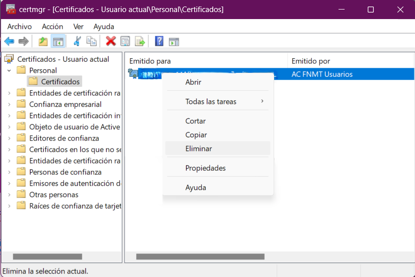

# 📂Mi Carpeta Ciudadana

**Mi Carpeta Ciudadana** es una aplicación que facilita el acceso a la documentación personal y administrativa a través de un dispositivo móvil o desde un navegador web. Esta guía se centrará en cómo iniciar sesión con un certificado digital y explorar las principales características de la aplicación.

    <a href="https://play.google.com/store/apps/details?id=es.gob.carpeta" target="_blank" style="
        display: inline-block;
        padding: 10px 20px;
        font-family: Arial, sans-serif;
        font-size: 14px;
        font-weight: bold;
        color: #ffffff;
        background-color: #34A853;
        border: none;
        border-radius: 4px;
        text-align: center;
        text-decoration: none;
        transition: background-color 0.3s ease;
        -webkit-transition: background-color 0.3s ease;
        -moz-transition: background-color 0.3s ease;
        -o-transition: background-color 0.3s ease;
    " onmouseover="this.style.backgroundColor='#2C8C42';" onmouseout="this.style.backgroundColor='#34A853';">
        
        Instalar desde Google Play Store
    </a>

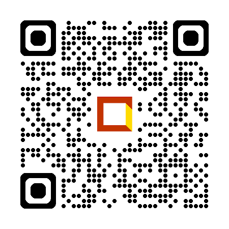

> [!TIP]
>
> Puedes escanear con tu móvil el código QR para abrir Google Play Store e instalar la aplicación directamente.

- **¿Qué es Mi Carpeta Ciudadana?**
  - **Mi Carpeta Ciudadana** es un espacio personal en línea que facilita la relación con las Administraciones Públicas. Puedes acceder tanto a su versión web como a la aplicación móvil.
  - **Versión Web**: Puedes acceder a través de [este enlace](https://carpetaciudadana.gob.es).
  - **App Móvil**: La aplicación está disponible para iOS y Android. Actualmente, ha superado las 100,000 descargas en Google Play Store y se encuentra entre las más populares en la categoría de productividad.

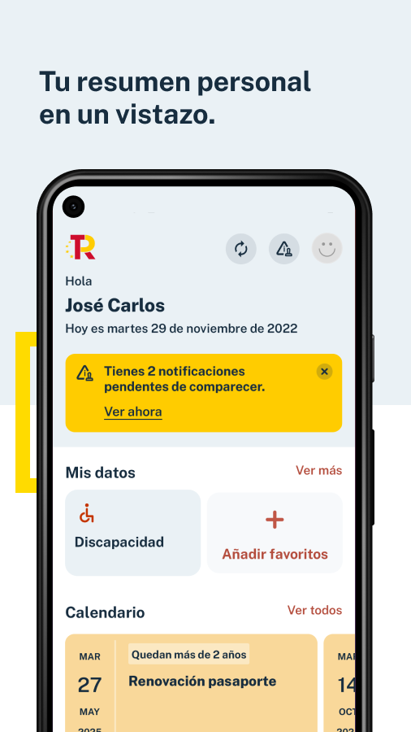

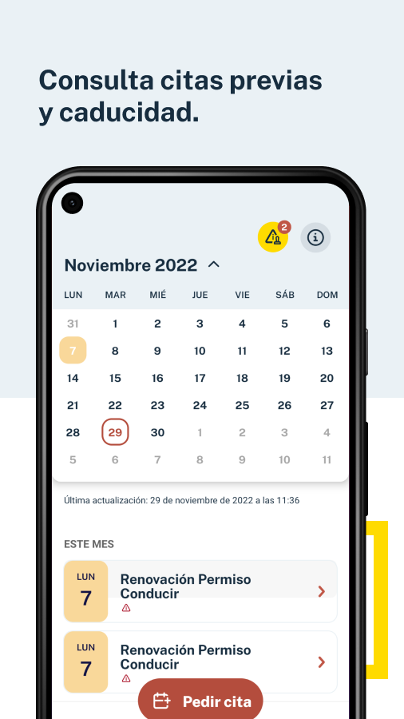

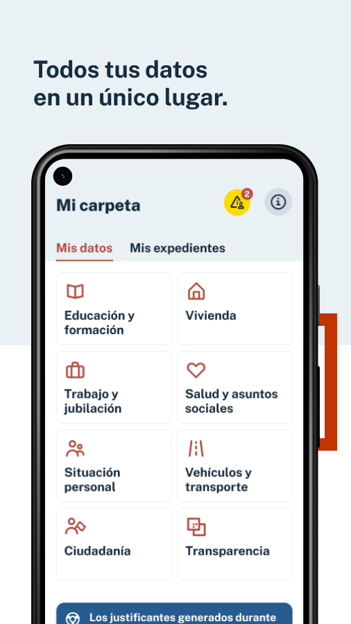

Aquí tienes algunas curiosidades y utilidades destacadas:

1. **Consulta de datos personales**: Puedes revisar información personal como tu **empadronamiento**, antecedentes penales y de delitos sexuales, y tu título de familia numerosa. También puedes acceder a tu **certificado literal de nacimiento** (hoja manuscrita escaneada).
2. **Educación y formación**: Accede a tus **títulos** universitarios y no universitarios, matrículas en la universidad, y certificados de formación.
3. **Trabajo y jubilación**: Consulta tu **vida laboral**, **demanda de empleo** y prestaciones de **desempleo**.
4. **Salud y asuntos sociales**: Obtén tu **certificado COVID** digital de la UE y verifica si tienes alguna **discapacidad** registrada.
5. **Vivienda**: Revisa información sobre tus bienes **inmuebles** y datos de **empadronamiento**.
6. **Notificaciones y alertas**: Recibe avisos sobre **trámites pendientes**, como la **renovación del DNI** o pasaporte, y notificaciones de expedientes en trámite.
7. **Citas previas**: Gestiona y consulta tus **citas previas** con diferentes administraciones públicas.
8. **Acceso rápido y seguro**: Utiliza reconocimiento biométrico para acceder rápidamente a la app con tu certificado digital o bien con cl@ve pin.
9. **Favoritos**: Añade trámites que consultas habitualmente a una **lista de favoritos** para un acceso más rápido.

# Videos explicativos

A continuación tendrás videos donde se explican todos los procesos que hemos visto como, solicitar, instalar y renovar el certificado digital, paso por paso y sin cortes, para veas todo el proceso desde principio a fin y así los puedas seguir fácilmente.

> [!NOTE]
>
> Se recomienda siempre buscar información actualizada ya que estos procesos suelen cambiar a menudo.

## 🎬Para solicitar y descargar

<iframe width="560" height="315" src="https://www.youtube.com/embed/h8crDF7az_c?si=nyhUlGa_QcHPYo6R" title="YouTube video player" frameborder="0" allow="accelerometer; autoplay; clipboard-write; encrypted-media; gyroscope; picture-in-picture; web-share" referrerpolicy="strict-origin-when-cross-origin" allowfullscreen></iframe>

## 🎬Para instalar

<iframe width="560" height="315" src="https://www.youtube.com/embed/deuU7zcK5Sw?si=aaGNzK8arxLk00Jq" title="YouTube video player" frameborder="0" allow="accelerometer; autoplay; clipboard-write; encrypted-media; gyroscope; picture-in-picture; web-share" referrerpolicy="strict-origin-when-cross-origin" allowfullscreen></iframe>

## 🎬Para renovar

<iframe width="560" height="315" src="https://www.youtube.com/embed/f69W3JcAuv4?si=K0nlYqISwsw36nD1" title="YouTube video player" frameborder="0" allow="accelerometer; autoplay; clipboard-write; encrypted-media; gyroscope; picture-in-picture; web-share" referrerpolicy="strict-origin-when-cross-origin" allowfullscreen></iframe>

# Enlaces de interés

| Recurso                                       | Enlace                                                       |
| --------------------------------------------- | ------------------------------------------------------------ |
| Página Principal de la FNMT                   | [https://www.sede.fnmt.gob.es/](https://www.sede.fnmt.gob.es/) |
| Dónde usar el certificado                     | https://www.cert.fnmt.es/que-es-ceres/donde-puedo-usar-mi-certificado |
| Solicitud de Certificado para Persona Física  | [https://www.sede.fnmt.gob.es/certificados/persona-fisica/solicitar-certificado](https://www.sede.fnmt.gob.es/certificados/persona-fisica/solicitar-certificado) |
| Oficinas de Acreditación de Identidad         | [https://www.sede.fnmt.gob.es/certificados/persona-fisica/acreditar-identidad](https://www.sede.fnmt.gob.es/certificados/persona-fisica/acreditar-identidad) |
| Descarga del Certificado                      | [https://www.sede.fnmt.gob.es/certificados/persona-fisica/descargar-certificado](https://www.sede.fnmt.gob.es/certificados/persona-fisica/descargar-certificado) |
| Renovación de Certificado para Persona Física | [https://www.sede.fnmt.gob.es/certificados/persona-fisica/renovar-certificado](https://www.sede.fnmt.gob.es/certificados/persona-fisica/renovar-certificado) |
| App Mi Carpeta Ciudadana                      | https://play.google.com/store/apps/details?id=es.gob.carpeta |
| Web Mi Carpeta Ciudadana                      | https://carpetaciudadana.gob.es/                             |
